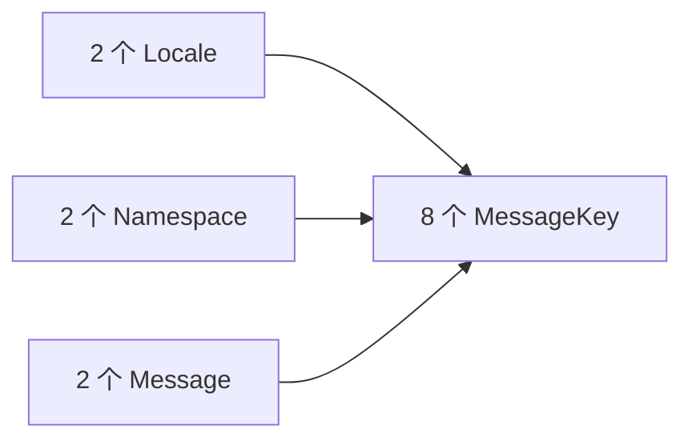
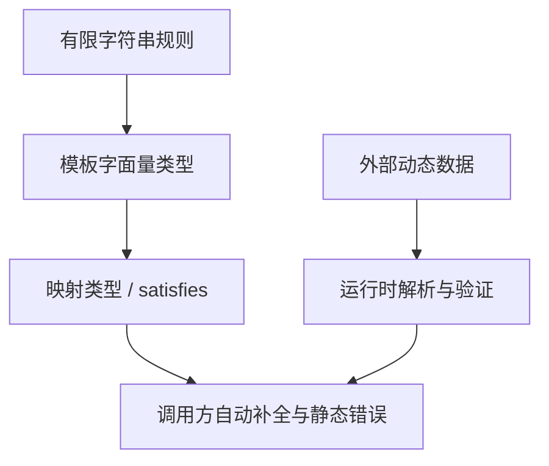

# TypeScript 模板字面量类型与类型安全契约

> 适用环境：TypeScript 7.x、Node.js 22+、`strict` 模式。本节只在规模有限、规则稳定的字符串集合中使用类型级组合；外部字符串仍需运行时解析和校验。

## 1. 学习目标

完成本节后，你应该能够：

- 区分 JavaScript 模板字符串与 TypeScript 模板字面量类型。
- 使用字符串字面量和联合类型生成有规则的字符串集合。
- 理解多个联合插值位置产生的笛卡尔积。
- 使用 `Uppercase`、`Lowercase`、`Capitalize` 和 `Uncapitalize`。
- 从对象键派生事件名、Getter、Setter 和配置键。
- 使用模板匹配与 `infer` 从字符串结构中提取信息。
- 为路由参数、国际化键和领域事件建立类型安全契约。
- 理解 `satisfies`、类型注解、类型断言和 `as const` 的差异。
- 使用 `as const satisfies` 同时获得只读字面量推断与结构校验。
- 识别大型联合、宽泛 `string`、动态输入和运行时验证的边界。

## 2. 前置知识

建议先掌握：

- 字符串字面量类型和联合类型。
- 泛型与泛型约束。
- `keyof`、索引访问类型与条件类型。
- `infer`、映射类型和键重映射 `as`。
- `Record`、`Pick` 等常用工具类型。

上一节：[TypeScript 映射类型与常用工具类型](/frontend/typescript/mapped-types-and-utility-types)

## 3. 为什么字符串也需要类型关系

前端工程中有大量带规则的字符串：

- `titleChanged` 表示 `title` 字段变化。
- `/api/v1/lessons` 表示资源端点。
- `lesson.created` 表示领域事件。
- `zh-CN.lesson.title` 表示国际化消息键。
- `VITE_API_BASE_URL` 表示环境变量名。

如果全部写成普通 `string`：

```ts
function on(eventName: string, callback: (value: unknown) => void) {
  // ...
}
```

编译器无法发现拼写错误，也无法建立事件名与回调参数之间的关系。

模板字面量类型可以把字符串命名规则提升为静态契约，同时仍保留普通字符串在运行时的实现方式。

## 4. 基本语法

JavaScript 模板字符串出现在值位置：

```ts
const world = 'world'
const greeting = `hello ${world}`
```

模板字面量类型出现在类型位置：

```ts
type World = 'world'
type Greeting = `hello ${World}`
// 'hello world'
```

两者语法相似，但职责不同：

| 能力 | 模板字符串 | 模板字面量类型 |
| --- | --- | --- |
| 存在阶段 | 运行时 | 编译期 |
| 生成真实字符串 | 能 | 不能 |
| 组合字符串类型 | 不能 | 能 |
| 校验真实外部输入 | 通过代码实现 | 不能 |

## 5. 拼接字符串字面量

```ts
type Resource = 'lesson'
type Action = 'created'
type EventName = `${Resource}.${Action}`
// 'lesson.created'
```

每个插值位置都必须能表示为模板字符串支持的原始值类型。工程中最常见的是字符串字面量联合。

```ts
type ApiVersion = 'v1'
type LessonEndpoint = `/api/${ApiVersion}/lessons`
// '/api/v1/lessons'
```

模板字面量类型适合描述格式，不会自动把任意字符串转换成该格式。

## 6. 联合类型会展开

插值位置是联合类型时，结果包含每个成员对应的字符串：

```ts
type Resource = 'lesson' | 'course'
type Action = 'created' | 'updated'

type DomainEvent = `${Resource}.${Action}`
// 'lesson.created'
// | 'lesson.updated'
// | 'course.created'
// | 'course.updated'
```

这不是字符串模糊匹配，而是有限集合的静态展开。

## 7. 多个联合产生笛卡尔积

每个插值位置的联合都会相互组合：

```ts
type Locale = 'zh-CN' | 'en-US'
type Namespace = 'lesson' | 'course'
type Message = 'title' | 'description'

type MessageKey = `${Locale}.${Namespace}.${Message}`
```

结果共有 `2 × 2 × 2 = 8` 个成员。



当多个集合很大时，组合数量会迅速膨胀，增加类型检查和编辑器提示成本。

## 8. 大型字符串集合应预生成

模板字面量类型适合：

- 少量稳定状态。
- 本地组件事件。
- 有限资源与操作的组合。
- 小型配置键和国际化键。

以下场景通常更适合代码生成或运行时 Schema：

- 数千条国际化消息。
- 从 OpenAPI 派生的全部路由。
- 数据库或 CMS 动态字段。
- 插件生态提供的任意事件名。

官方文档也建议大型字符串联合使用提前生成。类型系统应帮助维护，而不是成为另一个昂贵的编译器。

## 9. 宽泛 `string` 会降低精度

```ts
type DynamicResource = string
type DynamicEvent = `${DynamicResource}.created`
```

`DynamicEvent` 表示“任意以 `.created` 结尾的字符串”，不再是可穷举的有限联合。

它仍比普通 `string` 多一个格式约束，但无法提供完整自动补全或穷尽检查。若资源集合本来有限，应保留字面量联合，不要过早扩大为 `string`。

## 10. 内置字符串操作类型

TypeScript 提供四个编译器内置工具：

```ts
type Upper = Uppercase<'typescript'>
// 'TYPESCRIPT'

type Lower = Lowercase<'VUE'>
// 'vue'

type Capitalized = Capitalize<'lesson'>
// 'Lesson'

type Uncapitalized = Uncapitalize<'Course'>
// 'course'
```

它们不需要导入，也不是普通运行时函数。

## 11. 字符串操作不是本地化方案

内置字符串操作采用类似 JavaScript `toUpperCase()`、`toLowerCase()` 的非 locale-aware 映射，不能代替本地化大小写规则。

```ts
type GetterName<Key extends string> =
  `get${Capitalize<Key>}`
```

它适合代码标识符和协议键，不应被用于生成面向用户的本地化文案。真实 UI 文案仍应由国际化资源管理。

## 12. 从对象键派生事件名

```ts
interface LessonForm {
  title: string
  durationMinutes: number
  published: boolean
}

type ChangeEventName<Type> =
  `${string & keyof Type}Changed`

type LessonChangeEvent = ChangeEventName<LessonForm>
// 'titleChanged'
// | 'durationMinutesChanged'
// | 'publishedChanged'
```

`keyof Type` 可能包含 `string | number | symbol`；`string & keyof Type` 只保留字符串键，满足模板字面量的命名需求。

## 13. 让事件名与回调值关联

只限制事件名还不够，回调值也应与原字段类型一致：

```ts
type PropEventSource<Type> = {
  on<Key extends string & keyof Type>(
    eventName: `${Key}Changed`,
    callback: (newValue: Type[Key]) => void
  ): void
}
```

```ts
declare const lessonEvents: PropEventSource<LessonForm>

lessonEvents.on('titleChanged', title => {
  title.toUpperCase() // title 是 string
})

lessonEvents.on('publishedChanged', published => {
  console.log(published ? '已发布' : '草稿')
})
```

编译器从事件字符串的 `Changed` 前缀部分反向推断 `Key`，再通过 `Type[Key]` 得到回调值类型。

## 14. 从键生成 Getter

模板字面量类型与映射类型的键重映射可以生成对象 API：

```ts
type Getters<Type> = {
  [Key in keyof Type as
    `get${Capitalize<string & Key>}`
  ]: () => Type[Key]
}
```

```ts
type LessonGetters = Getters<LessonForm>
// getTitle(): string
// getDurationMinutes(): number
// getPublished(): boolean
```

这适合框架适配层或库 API。普通业务对象如果直接访问属性更清晰，就没有必要人为生成 Getter 类型。

## 15. 同时生成 Getter 与 Setter

```ts
type Accessors<Type> = {
  [Key in keyof Type as
    `get${Capitalize<string & Key>}`
  ]: () => Type[Key]
} & {
  [Key in keyof Type as
    `set${Capitalize<string & Key>}`
  ]: (value: Type[Key]) => void
}
```

交叉类型把两组映射结果组合起来。接口会随原模型字段同步，但也会让公共 API 快速增长，应评估是否真正改善调用体验。

## 16. 使用条件类型匹配字符串

模板字面量类型可以出现在条件类型的匹配结构中：

```ts
type EventKey<Event extends string> =
  Event extends `${infer Key}Changed`
    ? Key
    : never
```

```ts
type A = EventKey<'titleChanged'>
// 'title'

type B = EventKey<'lesson.created'>
// never
```

这里的 `infer Key` 捕获 `Changed` 之前的字符串片段。

## 17. 模板匹配遵循结构而非正则表达式

```ts
type SplitOnce<Value extends string> =
  Value extends `${infer Head}.${infer Tail}`
    ? [Head, Tail]
    : [Value]
```

```ts
type Parts = SplitOnce<'lesson.created.v1'>
// ['lesson', 'created.v1']
```

它按模板结构推断，不提供完整正则表达式语法，也不会在运行时解析字符串。

需要复杂语法、转义、错误位置或安全校验时，应使用真实解析器。

## 18. 递归拆分字符串

可以递归处理分隔符：

```ts
type Split<
  Value extends string,
  Separator extends string
> = Value extends `${infer Head}${Separator}${infer Tail}`
  ? [Head, ...Split<Tail, Separator>]
  : [Value]
```

```ts
type EventParts = Split<'lesson.created.v1', '.'>
// ['lesson', 'created', 'v1']
```

递归必须有明确终止分支。空分隔符、很长字符串和复杂联合都会增加实例化成本，业务代码中应限制输入范围。

## 19. 提取路由参数名

路由模板中的 `:param` 可以转为参数键联合：

```ts
type RouteParamNames<Path extends string> =
  Path extends `${string}:${infer Param}/${infer Rest}`
    ? Param | RouteParamNames<`/${Rest}`>
    : Path extends `${string}:${infer Param}`
      ? Param
      : never
```

```ts
type LessonRouteParams = RouteParamNames<
  '/courses/:courseId/lessons/:lessonId'
>
// 'courseId' | 'lessonId'
```

再与 `Record` 组合：

```ts
type ParamsFor<Path extends string> = Record<
  RouteParamNames<Path>,
  string
>
```

调用者必须提供完整参数，但类型仍不会检查参数值是否合法、URL 是否需要编码或路由模板是否来自可信来源。

## 20. 构建路由时仍需运行时代码

```ts
function buildRoute<Path extends string>(
  template: Path,
  params: ParamsFor<Path>
): string {
  return template.replace(
    /:([A-Za-z0-9_]+)/g,
    (_match, key: string) =>
      encodeURIComponent(
        params[key as RouteParamNames<Path>]
      )
  )
}
```

```ts
const route = buildRoute(
  '/courses/:courseId/lessons/:lessonId',
  {
    courseId: 'ts',
    lessonId: 'template-literals'
  }
)
```

类型契约检查参数键，正则替换与 `encodeURIComponent` 才真正构造 URL。实现中的受控断言集中在路由边界，并依赖正则捕获与类型算法保持一致。

## 21. 可选路由参数会增加复杂度

真实路由可能包含：

- 可选参数。
- 通配符。
- 重复参数。
- 查询字符串。
- 参数约束和转义。

为成熟路由库重新实现完整类型解析通常不值得。优先使用框架或库提供的官方类型；自定义解析只适合规则小而稳定的内部 DSL。

## 22. 国际化消息键

有限的语言、命名空间和消息名可以组合成完整键：

```ts
type Locale = 'zh-CN' | 'en-US'
type Namespace = 'lesson' | 'course'
type MessageName = 'title' | 'description'

type I18nKey =
  `${Locale}.${Namespace}.${MessageName}`
```

```ts
const messages: Record<I18nKey, string> = {
  'zh-CN.lesson.title': '课程标题',
  'zh-CN.lesson.description': '课程说明',
  'zh-CN.course.title': '课程体系标题',
  'zh-CN.course.description': '课程体系说明',
  'en-US.lesson.title': 'Lesson title',
  'en-US.lesson.description': 'Lesson description',
  'en-US.course.title': 'Course title',
  'en-US.course.description': 'Course description'
}
```

大型国际化项目应从资源文件生成键，避免维护一套与真实文案分离的手写联合。

## 23. 领域事件命名

```ts
type Aggregate = 'lesson' | 'course'
type PastTenseAction = 'created' | 'updated' | 'published'
type DomainEventName = `${Aggregate}.${PastTenseAction}`
```

有限联合能统一命名格式并提供自动补全，但并不代表所有组合都有业务意义。

例如 `course.published` 如果不允许，就不应该通过笛卡尔积生成。应改成显式联合：

```ts
type DomainEventName =
  | 'lesson.created'
  | 'lesson.updated'
  | 'lesson.published'
  | 'course.created'
  | 'course.updated'
```

类型应表达真实领域集合，而不是为了短小制造无效组合。

## 24. 环境变量键

```ts
type PublicEnvName =
  | 'API_BASE_URL'
  | 'APP_TITLE'

type VitePublicEnvKey = `VITE_${PublicEnvName}`
```

这能限制本地封装函数接受的键：

```ts
function readPublicEnv(key: VitePublicEnvKey): string {
  // 这里只演示契约，真实实现由构建工具环境决定
  return key
}
```

环境变量在运行时仍可能缺失或格式错误。类型不能证明部署环境实际提供了它们，必须在应用启动时校验。

## 25. 什么是 `satisfies`

`satisfies` 检查一个表达式是否可赋值给目标类型，同时尽量保留表达式自身更具体的推断结果：

```ts
type Status = 'draft' | 'published'

const statusConfig = {
  draft: {
    label: '草稿',
    color: 'gray'
  },
  published: {
    label: '已发布',
    color: 'green'
  }
} satisfies Record<
  Status,
  { label: string; color: string }
>
```

它特别适合需要检查键完整性、但又希望保留每个属性具体结构的配置对象。

## 26. 类型注解与 `satisfies`

使用类型注解时，变量直接以目标类型为准：

```ts
type Value = string | readonly [number, number, number]

const annotated: Record<'green' | 'red', Value> = {
  green: '#00ff00',
  red: [255, 0, 0]
}
```

读取 `annotated.green` 时，静态类型是联合 `Value`，需要进一步收窄。

使用 `satisfies`：

```ts
const checked = {
  green: '#00ff00',
  red: [255, 0, 0]
} satisfies Record<'green' | 'red', Value>

checked.green.toUpperCase()
```

目标结构得到检查，同时 `green` 仍保留适合字符串方法的精确类型。

## 27. 类型断言与 `satisfies`

类型断言告诉编译器“按这个类型看待表达式”：

```ts
const config = value as AppConfig
```

它可能绕过本应发现的不兼容，尤其是双重断言。`satisfies` 则要求表达式真正兼容目标类型：

```ts
const config = {
  mode: 'production'
} satisfies AppConfig
```

| 写法 | 检查兼容性 | 变量采用目标类型 | 保留表达式具体信息 |
| --- | --- | --- | --- |
| `const x: T = value` | 是 | 是 | 可能减少 |
| `value satisfies T` | 是 | 否 | 通常更多 |
| `value as T` | 较弱 | 作为 `T` 使用 | 由断言决定 |

`satisfies` 不是类型转换，也不会生成运行时代码。

## 28. `as const` 与 `satisfies`

`as const` 让字面量属性保持更窄，并将对象属性和数组视为只读：

```ts
const endpoints = {
  lessons: '/api/v1/lessons',
  courses: '/api/v1/courses'
} as const
```

`satisfies` 负责结构校验：

```ts
type Resource = 'lessons' | 'courses'
type Endpoint = `/api/v1/${Resource}`

const endpoints = {
  lessons: '/api/v1/lessons',
  courses: '/api/v1/courses'
} as const satisfies Record<Resource, Endpoint>
```

组合顺序表达了：“保留只读字面量信息，并验证它满足完整端点映射。”

## 29. `satisfies` 不会主动冻结对象

```ts
const settings = {
  theme: 'dark'
} satisfies { theme: string }

settings.theme = 'light'
```

这通常是合法的，因为 `satisfies` 不是只读操作。需要只读字面量时使用 `as const`、显式 `readonly` 或 `Readonly<T>`，并区分静态只读与运行时冻结。

## 30. `satisfies` 与额外属性检查

对象字面量配合有限键 `Record` 可以发现拼写错误和多余键：

```ts
type Status = 'draft' | 'review' | 'published'

const labels = {
  draft: '草稿',
  review: '审核中',
  published: '已发布'
} satisfies Record<Status, string>
```

少写键或写成 `publised` 会报错。若目标是 `Record<string, string>`，任意字符串键本来就合法，自然无法检查有限键拼写。

## 31. `satisfies` 不能验证动态数据

```ts
const config = JSON.parse(text)
```

如果 `JSON.parse` 的结果是 `any`，后接 `satisfies AppConfig` 不能把未知 JSON 变成可信数据，也不会在运行时执行验证。

正确边界应是：


`satisfies` 最适合检查源代码中可见的静态配置对象。

## 32. 用 `satisfies` 定义路由表

```ts
type PageName = 'lessonList' | 'lessonDetail'
type AppRoute =
  | '/lessons'
  | '/lessons/:lessonId'

const routes = {
  lessonList: '/lessons',
  lessonDetail: '/lessons/:lessonId'
} as const satisfies Record<PageName, AppRoute>
```

这样可以同时获得：

- 页面名完整性检查。
- 路由格式检查。
- `routes.lessonDetail` 的精确字面量类型。
- 后续从具体路由提取参数名的能力。

```ts
type DetailParams = ParamsFor<typeof routes.lessonDetail>
// { lessonId: string }
```

## 33. 用 `satisfies` 定义事件配置

```ts
type LessonEvent =
  | 'lesson.created'
  | 'lesson.published'

type EventMetadata = {
  durable: boolean
  description: string
}

const eventMetadata = {
  'lesson.created': {
    durable: true,
    description: '课程创建完成'
  },
  'lesson.published': {
    durable: true,
    description: '课程正式发布'
  }
} satisfies Record<LessonEvent, EventMetadata>
```

新增事件时，配置遗漏会在编译阶段暴露。事件真实载荷仍应由可辨识联合或 Schema 独立描述。

## 34. 类型安全契约的分层

可靠的前端契约通常包含三层：

1. **名称集合**：字面量联合、模板字面量类型。
2. **静态对应关系**：泛型、索引访问、映射类型、`satisfies`。
3. **运行时边界**：路由实现、数据校验、URL 编码、权限检查。



任何一层都不能替代另外两层。

## 35. 完整项目示例：课程路由与事件配置

本站提供可运行源码：

```text
examples/typescript/template-literal-types-and-type-safe-contracts.ts
```

<<< ../../../examples/typescript/template-literal-types-and-type-safe-contracts.ts

示例包含：

1. 由资源名派生 API 端点。
2. 使用 `as const satisfies` 定义完整端点表。
3. 从路由模板递归提取参数键。
4. `buildRoute` 在运行时替换并编码参数。
5. 从课程表单字段派生变化事件名。
6. 事件名与回调参数类型的对应关系。
7. 使用 `satisfies` 检查领域事件元数据。

## 36. 常见错误

### 把模板字面量类型当作运行时格式校验

来自地址栏、接口或存储的字符串仍是动态数据，必须在运行时验证。

### 组合出大量无效字符串

笛卡尔积会生成所有组合。如果领域只允许部分组合，应写显式联合或从单一数据源生成类型。

### 让联合规模爆炸

多个大型联合相乘会降低类型检查和编辑器性能。大型集合应提前生成。

### 过早扩大成 `string`

宽泛 `string` 会失去有限集合的穷尽检查和精确自动补全。

### 误以为 `satisfies` 改变变量类型

它检查兼容性，但表达式不会简单变成目标类型。需要公共 API 明确采用某类型时仍可使用类型注解。

### 用 `satisfies` 代替数据校验

类型系统会擦除，不能验证 JSON、环境变量或用户输入。

### 用类型断言掩盖实现不一致

字符串拼装函数中的断言必须集中、可解释，并由测试验证运行时算法与类型算法一致。

### 为成熟 DSL 重写类型解析器

路由、SQL、GraphQL 等复杂语法应优先使用生态库或代码生成提供的类型。

## 37. 工程最佳实践

- 只为有限、稳定且能改善调用体验的字符串规则建立模板类型。
- 先写真实领域集合，再决定能否安全地用笛卡尔积生成。
- 从对象键和单一配置源派生名称，减少重复声明。
- 泛型回调使用 `Type[Key]` 保持名称和值类型关联。
- 模板匹配与递归类型必须有清晰终止条件。
- 大型国际化键、API 路由和 Schema 优先使用代码生成。
- 配置字面量使用 `satisfies` 检查结构并保留精确推断。
- 需要只读字面量时使用 `as const satisfies`，不要混淆二者职责。
- 对外函数参数和返回值仍应根据 API 需要提供显式类型注解。
- 动态数据从 `unknown` 开始，经过运行时验证后再进入静态类型世界。
- 受控断言集中在实现边界，并通过测试保证与类型规则一致。
- 类型错误开始难以理解或编辑器变慢时，应降低类型级抽象复杂度。

## 38. 与 Vue 3 的联系

### 组件事件

Vue 组件事件通常是有限集合。可以用字面量联合或对象式事件声明确保事件名和载荷类型匹配，不必为了模板字面量类型而绕开 Vue 官方 API。

若多个字段都遵循统一的 `update:field` 规则，可派生名称：

```ts
type FormField = 'title' | 'summary'
type UpdateEvent = `update:${FormField}`
```

### `v-model`

Vue 的命名 `v-model` 使用 `update:modelName` 约定。模板字面量类型能描述这一格式，但组件运行时仍必须真正声明并触发对应事件。

### 路由

从静态路由表保留字面量后，可以派生页面名或参数键。成熟项目应优先采用 Vue Router 提供的类型化路由能力或生成方案，避免维护不完整的自定义解析器。

## 39. 与后端和协议生成的联系

模板字面量类型适合描述小型 REST 路径前缀、事件主题和缓存键。但后端协议往往包含参数约束、版本兼容和权限规则，不能只靠字符串格式表达。

如果契约由 OpenAPI、GraphQL Schema、Protobuf 或 AsyncAPI 定义，应让协议成为单一事实来源，通过生成器得到前端类型。模板类型可在生成结果之上提供少量本地组合，而不应复制整套协议。

## 40. 概念辨析与因果回顾

### 什么是模板字面量类型？

它是在类型位置使用模板字符串语法，根据字面量和联合类型生成新的字符串字面量类型。

### 联合类型放在多个插值位置会怎样？

每个位置的成员会交叉组合，形成笛卡尔积。组合数量是各联合成员数量的乘积。

### 如何从 `titleChanged` 提取 `title`？

使用条件类型匹配 `` `${infer Key}Changed` ``，真分支得到推断出的 `Key`。

### `Capitalize<T>` 是运行时函数吗？

不是。它是编译器内置的类型级字符串操作，不生成 JavaScript，也不负责本地化规则。

### `satisfies` 与类型注解有何区别？

二者都会检查兼容性；类型注解让变量采用目标类型，`satisfies` 通常保留表达式自身更具体的推断结果。

### `satisfies` 与 `as` 有何区别？

`satisfies` 要求表达式兼容目标类型；`as` 是类型断言，可能绕开部分不兼容检查。两者都不执行运行时验证。

### 为什么常见 `as const satisfies`？

`as const` 保留只读字面量信息，`satisfies` 校验该精确对象符合目标契约，二者职责互补。

## 41. 本节总结

- 模板字面量类型在类型位置组合字符串字面量。
- 联合插值会展开，多个位置形成笛卡尔积。
- 大型字符串联合应考虑提前生成，避免类型规模爆炸。
- `Uppercase`、`Lowercase`、`Capitalize`、`Uncapitalize` 是编译器内置工具。
- `string & keyof Type` 常用于从对象的字符串键派生命名。
- 泛型事件名可以与 `Type[Key]` 建立回调参数对应关系。
- 条件类型配合 `infer` 可以按模板结构拆解字符串。
- 路由参数类型只检查键，真实替换、编码和验证仍发生在运行时。
- `satisfies` 校验兼容性并通常保留更具体的表达式推断。
- 类型注解、类型断言、`as const` 与 `satisfies` 各有不同职责。
- `satisfies` 不能验证 JSON、环境变量或其他动态输入。
- 字符串类型契约应服务于真实领域规则，不能制造无效组合。

## 42. 下一步学习

下一节建议学习：[**TypeScript 工程配置与模块边界**](/frontend/typescript/project-configuration-and-module-boundaries)。

届时将继续讲解：

- `tsconfig.json` 的继承、包含范围与严格模式选项。
- `module`、`moduleResolution` 与 ESM/CJS 的关系。
- `verbatimModuleSyntax`、类型导入和运行时导入。
- 浏览器、Node.js 与测试环境的类型边界。
- 项目引用、声明文件和前端工程中的类型检查流程。

## 43. 参考资料

- [TypeScript Handbook：Template Literal Types](https://www.typescriptlang.org/docs/handbook/2/template-literal-types.html)
- [TypeScript Handbook：Mapped Types](https://www.typescriptlang.org/docs/handbook/2/mapped-types.html)
- [TypeScript Handbook：Conditional Types](https://www.typescriptlang.org/docs/handbook/2/conditional-types.html)
- [TypeScript Handbook：Utility Types](https://www.typescriptlang.org/docs/handbook/utility-types.html#intrinsic-string-manipulation-types)
- [TypeScript 4.1 Release Notes：Template Literal Types](https://www.typescriptlang.org/docs/handbook/release-notes/typescript-4-1.html#template-literal-types)
- [TypeScript 4.1 Release Notes：Key Remapping in Mapped Types](https://www.typescriptlang.org/docs/handbook/release-notes/typescript-4-1.html#key-remapping-in-mapped-types)
- [TypeScript 4.9 Release Notes：The `satisfies` Operator](https://www.typescriptlang.org/docs/handbook/release-notes/typescript-4-9.html#the-satisfies-operator)
