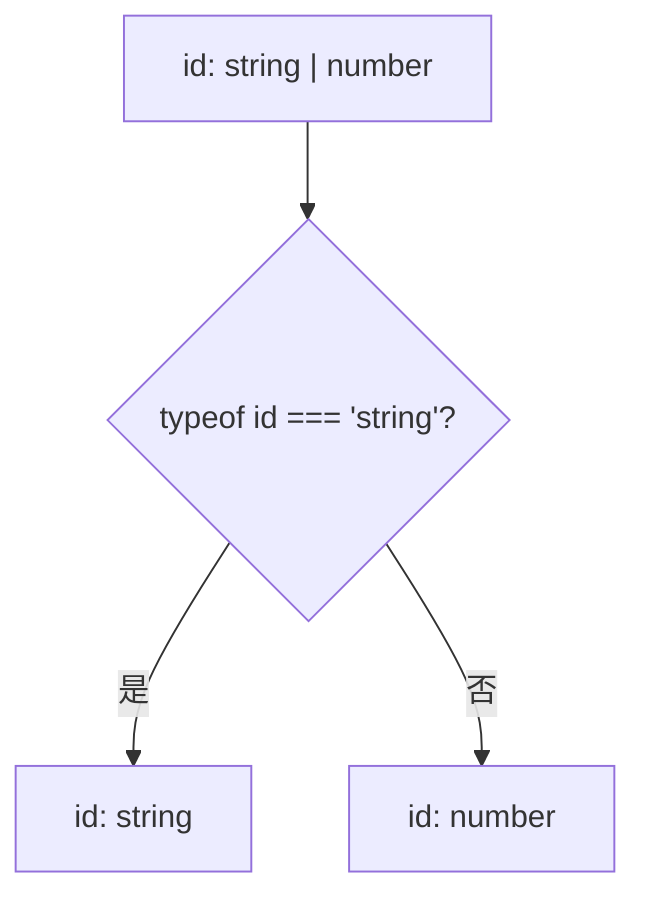
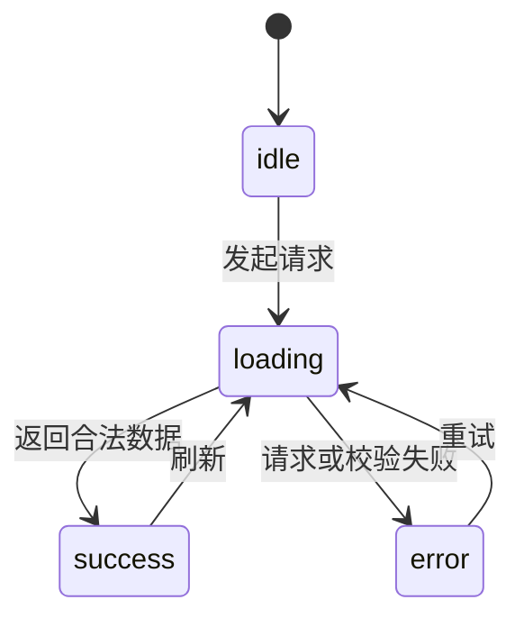
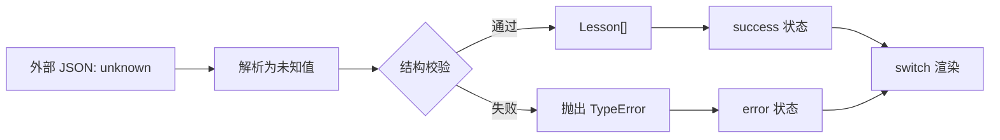

# TypeScript 联合类型、交叉类型与类型收窄进阶

> 适用环境：TypeScript 7.x、Node.js 22+、`strict` 模式。本文讨论的核心规则长期稳定；示例以本站当前 TypeScript 配置为准。

## 1. 学习目标

完成本节后，你应该能够：

- 准确区分联合类型（Union Type）和交叉类型（Intersection Type）。
- 理解为什么联合类型在收窄前只能使用所有成员共同支持的操作。
- 使用 `typeof`、相等性判断、`in`、`instanceof` 和 `Array.isArray` 收窄类型。
- 理解 TypeScript 的控制流分析（Control Flow Analysis）如何跟踪变量类型。
- 编写用户自定义类型谓词（Type Predicate）和断言函数（Assertion Function）。
- 使用可辨识联合（Discriminated Union）表达互斥、完整的业务状态。
- 使用 `never` 完成穷尽性检查，防止新增状态后遗漏处理分支。
- 识别交叉类型冲突、真值判断误伤、错误类型断言等常见问题。

## 2. 前置知识

建议先掌握：

- JavaScript 基本类型、对象、函数与条件分支。
- TypeScript 类型标注和类型推断。
- 对象类型、可选属性、只读属性和函数类型。
- `strictNullChecks` 的基本作用。

上一节：[TypeScript 对象类型与函数类型](/frontend/typescript/object-and-function-types)

## 3. 为什么需要组合类型

真实业务中的值经常不只有一种形态：

- 路由参数可能是数字 ID，也可能是字符串别名。
- 接口请求可能处于空闲、加载、成功或失败状态。
- 搜索条件可能是普通文本，也可能是结构化筛选对象。
- 登录结果可能包含用户，也可能包含明确的错误信息。

如果用一个充满可选属性的对象表示这些情况，很容易制造不可能或矛盾的状态：

```ts
interface RequestStateBad {
  loading: boolean
  data?: Lesson[]
  error?: string
}
```

这个类型允许下面的对象通过检查：

```ts
const impossible: RequestStateBad = {
  loading: true,
  data: [],
  error: '请求失败'
}
```

它同时表示“正在加载”“已经有数据”和“请求失败”。编译器无法知道这是否符合业务规则，因为类型本身没有表达这些状态互斥。

更合理的模型是：一个请求在某个时刻只能处于某一种状态。

```ts
type RequestState =
  | { status: 'idle' }
  | { status: 'loading'; startedAt: number }
  | { status: 'success'; data: Lesson[] }
  | { status: 'error'; message: string }
```

联合类型不仅描述“可能有哪些值”，还可以把业务规则交给编译器检查。

## 4. 联合类型：值是多个候选类型之一

联合类型使用竖线 `|` 连接成员：

```ts
type LessonId = string | number

function openLesson(id: LessonId): void {
  console.log(id)
}

openLesson('typescript-narrowing')
openLesson(3)
```

`LessonId` 表示一个值在运行时可能是 `string`，也可能是 `number`。它不表示该值同时具备字符串和数字的全部能力。

### 联合类型不是“所有成员能力的并集”

在尚未确定具体成员前，TypeScript 只允许使用每个成员都安全支持的操作：

```ts
function normalizeId(id: string | number): string {
  return id.toString() // string 和 number 都支持
}
```

下面的调用不安全：

```ts
function broken(id: string | number): string {
  return id.toUpperCase()
  //     ~~ number 没有 toUpperCase
}
```

从集合角度看，值的候选范围变大了，但未经收窄时可直接使用的成员能力反而是各成员的公共部分。

## 5. 字面量联合：让字符串成为有限状态

字面量类型（Literal Type）表示某个确定的值：

```ts
type LessonStatus = 'draft' | 'published' | 'archived'
```

这比普通 `string` 更准确：

```ts
function changeStatus(status: LessonStatus): void {
  console.log(status)
}

changeStatus('published') // 正确
changeStatus('publised')  // 错误：拼写不在联合成员中
```

字面量联合适合表示：

- 页面或请求状态。
- 权限角色。
- HTTP 方法。
- 组件尺寸和主题。
- 后端返回的有限状态码。

### 字面量推断可能被扩大

```ts
let status = 'loading'
```

因为 `let` 变量之后可以被重新赋值，`status` 通常会被推断为 `string`，而不是字面量 `'loading'`。

```ts
const status = 'loading' // 类型是 "loading"
```

对象属性即使放在 `const` 对象中，仍可能被修改，所以也可能被扩大：

```ts
const response = { status: 'success' }
// response.status 通常是 string
```

需要保留字面量时，可以提供目标类型或谨慎使用 `as const`：

```ts
const response: { status: 'success' } = { status: 'success' }

const frozenResponse = { status: 'success' } as const
// status 是 "success"，同时属性变为 readonly
```

`as const` 不会在运行时冻结对象；它只影响 TypeScript 的推断结果。

## 6. 类型收窄：用运行时证据排除候选类型

类型收窄（Narrowing）是指：代码通过条件判断提供运行时证据，TypeScript 据此把宽泛类型缩小为更具体的类型。

```ts
function formatId(id: string | number): string {
  if (typeof id === 'string') {
    return id.trim().toUpperCase()
  }

  return id.toFixed(0)
}
```

执行到 `if` 内部时，`typeof id === 'string'` 证明 `id` 是字符串。剩余分支中，字符串可能性已经被排除，因此 `id` 是数字。



类型收窄不是运行时转换。判断前后仍然是同一个值，只是编译器对它的认识更具体了。

## 7. `typeof` 类型守卫

JavaScript 的 `typeof` 可以返回这些常见字符串：

- `"string"`
- `"number"`
- `"bigint"`
- `"boolean"`
- `"symbol"`
- `"undefined"`
- `"object"`
- `"function"`

TypeScript 能识别相应判断：

```ts
function describe(value: string | number | (() => void)): string {
  if (typeof value === 'function') {
    value()
    return '执行了函数'
  }

  if (typeof value === 'number') {
    return `数字：${value.toFixed(2)}`
  }

  return `文本：${value.trim()}`
}
```

### `typeof null === 'object'` 的历史行为

JavaScript 中：

```ts
console.log(typeof null) // "object"
```

因此下面的判断不能排除 `null`：

```ts
function printKeys(value: object | null): void {
  if (typeof value === 'object') {
    // value 仍可能是 null
  }
}
```

应增加显式判断：

```ts
function printKeys(value: object | null): void {
  if (value !== null && typeof value === 'object') {
    console.log(Object.keys(value))
  }
}
```

## 8. 真值收窄及其陷阱

JavaScript 条件会把值转换为布尔值。以下值是假值（falsy）：

- `false`
- `0`、`-0`、`0n`
- 空字符串 `''`
- `null`
- `undefined`
- `NaN`

因此可以用真值判断排除 `null` 和 `undefined`：

```ts
function printTitle(title: string | null | undefined): void {
  if (title) {
    console.log(title.toUpperCase())
  }
}
```

但它也会排除空字符串。如果空字符串是合法输入，这种写法会改变业务含义：

```ts
function getLabel(value: string | null): string {
  if (value) {
    return value
  }

  return '未填写' // 空字符串也会走到这里
}
```

如果只想排除空值，应明确判断：

```ts
function getLabel(value: string | null): string {
  if (value !== null) {
    return value
  }

  return '未填写'
}
```

同理，不能用 `if (count)` 判断一个可能合法为 `0` 的数量是否存在。

## 9. 相等性收窄

TypeScript 会理解 `===`、`!==`、`==` 和 `!=` 带来的类型信息。

```ts
function compare(
  left: string | number,
  right: string | boolean
): void {
  if (left === right) {
    // 两边唯一可能共同拥有的类型是 string
    console.log(left.toUpperCase(), right.toUpperCase())
  }
}
```

最推荐使用严格相等 `===` 和严格不等 `!==`，因为它们不执行隐式类型转换。

有一个常见但需要理解语义的例外：`value != null` 会同时排除 `null` 和 `undefined`，这是 JavaScript 宽松相等规则的结果。

```ts
function print(value: string | null | undefined): void {
  if (value != null) {
    console.log(value.toUpperCase())
  }
}
```

团队如果统一禁止宽松相等，可以改为 `value !== null && value !== undefined`，含义更显式。

## 10. `in` 操作符收窄对象联合

`'property' in object` 在运行时检查属性是否存在于对象自身或原型链上。TypeScript 可以利用它收窄对象类型：

```ts
interface VideoLesson {
  kind: 'video'
  videoUrl: string
}

interface ArticleLesson {
  kind: 'article'
  content: string
}

function getResource(lesson: VideoLesson | ArticleLesson): string {
  if ('videoUrl' in lesson) {
    return lesson.videoUrl
  }

  return lesson.content
}
```

需要注意，可选属性可能出现在判断的两个分支中：

```ts
type Human = { swim?: () => void }
type Fish = { swim: () => void }
type Bird = { fly: () => void }

function move(value: Fish | Bird | Human): void {
  if ('swim' in value) {
    // value 可能是 Fish，也可能是 Human
  }
}
```

如果对象本身来自外部 `unknown` 数据，还要先确认它不是 `null` 且确实是对象，否则直接使用 `in` 会在运行时报错。

## 11. `instanceof` 和 `Array.isArray`

### `instanceof`

`instanceof` 检查对象的原型链是否包含构造函数的 `prototype`：

```ts
function formatDate(value: Date | string): string {
  if (value instanceof Date) {
    return value.toISOString()
  }

  return new Date(value).toISOString()
}
```

它适合类实例和 JavaScript 内置对象，但不适合接口：

```ts
interface Lesson {
  title: string
}

// value instanceof Lesson // 错误：接口在运行时不存在
```

跨 iframe、跨 JavaScript Realm 或存在多份库副本时，原型链身份可能不同，`instanceof` 也可能不符合预期。对普通 JSON 数据更适合检查结构或可辨识字段。

### `Array.isArray`

数组在 JavaScript 中也是对象：

```ts
typeof [] // "object"
```

判断数组应使用 `Array.isArray`：

```ts
function count(value: string | string[]): number {
  if (Array.isArray(value)) {
    return value.length
  }

  return value.trim().length
}
```

## 12. 控制流分析：类型会沿执行路径变化

TypeScript 不只看单个 `if`，还会分析赋值、提前返回和代码可达性。

### 提前返回后的收窄

```ts
function pad(value: string | number): string {
  if (typeof value === 'number') {
    return ' '.repeat(value)
  }

  // number 分支已经返回，走到这里时 value 只能是 string
  return value.trim()
}
```

### 重新赋值后的类型

```ts
let value: string | number = Math.random() > 0.5 ? '42' : 42

if (typeof value === 'string') {
  value = value.trim()
  // 这里仍是 string
}

value = 100 // 合法，因为声明类型允许 number
```

变量的声明类型仍然是 `string | number`。控制流只决定某个程序点上的观察类型，不会永久改写声明类型。

### 闭包和异步回调中的收窄可能失效

如果变量可能在回调执行前被修改，TypeScript 不能安全地保留之前的收窄结论：

```ts
let title: string | undefined = 'TypeScript'

if (title !== undefined) {
  setTimeout(() => {
    // 某些可变变量场景中，编译器不能假设 title 仍是 string
  }, 0)
}

title = undefined
```

常见做法是在已经收窄的作用域中创建不可变快照：

```ts
if (title !== undefined) {
  const currentTitle = title
  setTimeout(() => console.log(currentTitle.toUpperCase()), 0)
}
```

## 13. 用户自定义类型谓词

当普通条件较复杂或需要复用时，可以编写类型守卫函数。返回类型 `value is Lesson` 称为类型谓词：

```ts
interface Lesson {
  id: string
  title: string
  durationMinutes: number
}

function isRecord(value: unknown): value is Record<string, unknown> {
  return typeof value === 'object' && value !== null
}

function isLesson(value: unknown): value is Lesson {
  return (
    isRecord(value) &&
    typeof value.id === 'string' &&
    typeof value.title === 'string' &&
    typeof value.durationMinutes === 'number' &&
    Number.isFinite(value.durationMinutes) &&
    value.durationMinutes > 0
  )
}
```

调用后，TypeScript 会在成功分支中把值视为 `Lesson`：

```ts
function handlePayload(payload: unknown): string {
  if (isLesson(payload)) {
    return payload.title.toUpperCase()
  }

  return '无效课程数据'
}
```

### 类型谓词是一份需要你负责的承诺

编译器不会证明函数实现真的足以判断目标类型：

```ts
function isLessonUnsafe(value: unknown): value is Lesson {
  return true
}
```

这段代码能够通过类型检查，却会让任意值伪装成 `Lesson`。类型谓词必须覆盖后续代码依赖的全部结构约束；复杂生产项目可使用经过维护的 Schema 校验库，避免手写验证逻辑分散在各处。

## 14. 断言函数

类型谓词返回布尔值；断言函数在条件不满足时抛出错误，正常返回则告诉编译器条件成立。

```ts
function assertLesson(value: unknown): asserts value is Lesson {
  if (!isLesson(value)) {
    throw new TypeError('课程数据格式不正确')
  }
}

function parseLesson(value: unknown): Lesson {
  assertLesson(value)
  return value // 此处 value 已收窄为 Lesson
}
```

也可以断言普通条件：

```ts
function assert(condition: unknown, message: string): asserts condition {
  if (!condition) {
    throw new Error(message)
  }
}
```

断言函数适合“失败就不能继续”的系统边界，例如读取配置、解析接口响应或建立领域对象。不要把它当成跳过校验的类型断言 `as`；它必须真正执行运行时检查。

## 15. 可辨识联合：用共同字段表示互斥状态

可辨识联合由三部分组成：

1. 多个对象类型组成的联合。
2. 所有成员共享一个属性。
3. 该属性在每个成员中是不同的字面量类型。

```ts
interface IdleState {
  status: 'idle'
}

interface LoadingState {
  status: 'loading'
  startedAt: number
}

interface SuccessState {
  status: 'success'
  data: readonly Lesson[]
  receivedAt: number
}

interface ErrorState {
  status: 'error'
  error: {
    code: string
    message: string
    retryable: boolean
  }
}

type LessonRequestState =
  | IdleState
  | LoadingState
  | SuccessState
  | ErrorState
```

`status` 就是可辨识字段（Discriminant）。判断它后，整个对象会一起收窄：

```ts
function renderState(state: LessonRequestState): string {
  switch (state.status) {
    case 'idle':
      return '尚未请求课程'
    case 'loading':
      return `正在加载，开始时间：${state.startedAt}`
    case 'success':
      return `已加载 ${state.data.length} 节课程`
    case 'error':
      return `${state.error.code}：${state.error.message}`
  }
}
```

在 `success` 分支里可以安全访问 `data`，在 `error` 分支里可以安全访问 `error`。其他状态根本没有这些属性。



### 为什么优于多个可选属性

可辨识联合使非法状态难以表示：

```ts
const invalid: LessonRequestState = {
  status: 'success',
  error: { code: 'E500', message: '失败', retryable: true }
  // 错误：success 状态需要 data，不接受 error
}
```

这比依赖注释说明“成功时 error 必须为空”更可靠。

## 16. 使用 `never` 做穷尽性检查

当联合中的所有成员都被排除后，剩余值的类型是 `never`，表示该位置不可能出现值。

```ts
function assertNever(value: never): never {
  throw new Error(`未处理的状态：${JSON.stringify(value)}`)
}

function renderState(state: LessonRequestState): string {
  switch (state.status) {
    case 'idle':
      return '尚未请求课程'
    case 'loading':
      return '正在加载'
    case 'success':
      return `共 ${state.data.length} 节课程`
    case 'error':
      return state.error.message
    default:
      return assertNever(state)
  }
}
```

如果以后新增状态：

```ts
interface RefreshingState {
  status: 'refreshing'
  previousData: readonly Lesson[]
}
```

并加入联合，却忘记修改 `switch`，那么 `default` 分支中的 `state` 不再是 `never`，编译器会报错。这样新增业务状态时，所有需要同步更新的处理位置更容易被发现。

如果函数返回类型明确，也可以借助 `strictNullChecks` 和缺失返回路径发现部分遗漏，但 `assertNever` 通常能提供更直接的错误位置和意图。

## 17. 交叉类型：一个值同时满足多个类型

交叉类型使用 `&` 连接成员：

```ts
interface HasRequestId {
  requestId: string
}

interface HasTimestamp {
  timestamp: number
}

type RequestMetadata = HasRequestId & HasTimestamp

const metadata: RequestMetadata = {
  requestId: 'req-001',
  timestamp: Date.now()
}
```

`A & B` 表示值必须同时满足 `A` 和 `B`。它适合组合相互独立的能力或横切信息：

- 业务数据 + 审计字段。
- 请求状态 + 跟踪 ID。
- 基础模型 + 分页信息。
- 组件 Props + 通用可访问性属性。

```ts
type TrackedState = LessonRequestState & HasRequestId

const tracked: TrackedState = {
  requestId: 'req-002',
  status: 'loading',
  startedAt: Date.now()
}
```

交叉会分配到联合的各成员上进行理解，因此这里相当于每一种请求状态都额外带有 `requestId`。

### 交叉类型不会在运行时合并对象

类型表达式只描述结构，不会产生 JavaScript 合并操作：

```ts
type Combined = HasRequestId & HasTimestamp
```

这行代码不会创建任何对象。真正组合运行时值仍需要对象展开、`Object.assign` 或其他逻辑：

```ts
const combined: Combined = {
  ...requestIdPart,
  ...timestampPart
}
```

## 18. 交叉类型的属性冲突

交叉类型要求同一属性同时满足两边的约束：

```ts
type StringId = { id: string }
type NumberId = { id: number }
type Impossible = StringId & NumberId
```

`Impossible['id']` 必须同时是 `string` 和 `number`，结果通常是 `never`。正常值无法满足：

```ts
const value: Impossible = { id: '1' }
//                            ~~ string 不能赋给 never
```

这不是 TypeScript 自动选择其中一方，也不是运行时覆盖规则。出现冲突通常说明：

- 组合的领域概念不兼容。
- 属性命名过于宽泛。
- 应该先用 `Omit` 移除旧属性再定义新属性。
- 实际需要的是联合类型，而不是交叉类型。

```ts
type NumericEntity = Omit<StringId, 'id'> & { id: number }
```

不要用双重类型断言强行制造无法满足的交叉类型，那只会把问题推迟到运行时。

## 19. “对象的联合”与“联合属性的对象”

这两个类型看起来相似，表达能力却不同。

### 对象的联合

```ts
type Result =
  | { ok: true; data: Lesson[] }
  | { ok: false; error: string }
```

当 `ok` 为 `true` 时一定有 `data`；为 `false` 时一定有 `error`。字段之间存在关联。

### 联合属性的对象

```ts
interface LooseResult {
  ok: boolean
  data: Lesson[] | undefined
  error: string | undefined
}
```

每个属性各自拥有联合类型，但它们之间没有关联。下面这些矛盾组合仍然合法：

```ts
const loose: LooseResult = {
  ok: true,
  data: undefined,
  error: '失败'
}
```

只要字段的可用性依赖另一个字段，就优先考虑可辨识联合。

## 20. 可选属性不等于状态联合

可选属性表达“这个属性可能不存在”，适合独立、确实可选的信息：

```ts
interface LessonCard {
  title: string
  summary?: string
}
```

它不适合表达互斥分支：

```ts
interface PaymentBad {
  method: 'card' | 'bank'
  cardNumber?: string
  bankAccount?: string
}
```

这个类型允许银行卡支付没有卡号，也允许同时出现两种账号。更准确的模型是：

```ts
type Payment =
  | { method: 'card'; cardNumber: string }
  | { method: 'bank'; bankAccount: string }
```

判断 `method` 后，相关字段会自动收窄。这种设计同样适用于 Vue 组件 Props：当某个 Prop 决定其他 Props 是否必需时，可辨识联合通常比多个可选 Prop 更安全。

## 21. 完整项目示例：课程请求状态

本站提供可运行源码：

```text
examples/typescript/unions-intersections-and-narrowing.ts
```

示例组合了本节关键知识：

1. 外部输入先以 `unknown` 接收。
2. `isRecord` 和 `isLesson` 执行运行时结构检查。
3. 断言函数确保数组中每一项都是合法课程。
4. 可辨识联合描述四种互斥请求状态。
5. 交叉类型为所有状态附加请求跟踪信息。
6. `switch` 和 `assertNever` 保证状态处理完整。

核心数据流如下：



### 为什么边界使用 `unknown`

网络响应、浏览器存储和用户输入都是运行时数据，TypeScript 无法在编译阶段保证其结构。使用 `unknown` 会迫使代码先验证再使用：

```ts
const payload: unknown = JSON.parse(text)
```

直接写成下面这样只是告诉编译器相信开发者，不会验证数据：

```ts
const payload = JSON.parse(text) as Lesson[]
```

### 为什么成功状态直接保存可信类型

一旦边界校验完成，内部业务代码就不应该反复检查同一结构。成功状态只接收 `readonly Lesson[]`，形成“外部未知、边界验证、内部可信”的清晰分层。

## 22. 常见错误

### 在收窄前调用成员专属方法

```ts
function format(value: string | number): string {
  return value.toUpperCase()
}
```

数字没有该方法。先使用 `typeof` 判断，或改用两者共同支持的操作。

### 把 `typeof value === 'object'` 当成完整对象校验

它没有排除 `null`，也没有验证对象属性。外部数据至少需要检查非空对象和真正依赖的字段。

### 用真值判断误伤 `0` 和空字符串

只有当所有假值都代表“缺失”时才使用 `if (value)`；否则显式判断 `null` 或 `undefined`。

### 用类型断言代替收窄

```ts
function getTitle(value: unknown): string {
  return (value as Lesson).title
}
```

这不会验证 `value`。应使用守卫或断言函数提供运行时证据。

### 类型谓词实现不完整

如果 `isLesson` 只检查 `title`，却承诺完整 `Lesson`，后续访问其他字段仍可能崩溃。谓词签名越强，实现责任越大。

### 用交叉类型表示互斥选择

`CardPayment & BankPayment` 要求同时满足两种支付方式，不表示二选一。互斥选择应该使用 `|`。

### 忘记交叉属性可能冲突

同名属性不会按对象展开的先后顺序覆盖。它们必须同时兼容，否则可能得到 `never`。

### `switch` 没有穷尽检查

没有 `assertNever` 时，新增联合成员可能在旧代码中静默落入默认逻辑。关键领域状态应显式处理每个分支。

## 23. 工程最佳实践

- 用字面量联合代替含义有限的宽泛 `string`。
- 用可辨识联合表达互斥状态，让非法状态难以表示。
- 可辨识字段使用稳定、明确的名称，如 `status`、`kind`、`type` 或 `ok`。
- 外部数据使用 `unknown`，在系统边界集中完成运行时验证。
- 简单判断直接使用内置守卫；复杂且复用的结构检查封装为类型谓词或 Schema。
- 关键联合状态使用 `never` 做穷尽性检查。
- 交叉类型用于组合兼容能力，不用于掩盖模型冲突。
- 避免不必要的 `as`；断言没有运行时证据，也不会转换数据。
- 在回调和异步边界前保存已收窄值的 `const` 快照，减少可变状态导致的类型回退。
- 类型不仅描述数据形状，还应表达字段之间的业务关系。

## 24. 与 Vue、Java 和后端接口的联系

### Vue 异步页面状态

Vue 组件中常见的三个独立变量：

```ts
const loading = ref(false)
const data = ref<Lesson[]>()
const error = ref<string>()
```

可能组合出矛盾状态。可以改成：

```ts
const state = ref<LessonRequestState>({ status: 'idle' })
```

模板或计算属性通过 `state.value.status` 判断后，就能安全使用相应字段。

### Vue 组件 Props

如果组件支持链接和按钮两种模式：

```ts
type ActionProps =
  | { kind: 'link'; href: string }
  | { kind: 'button'; onClick: () => void }
```

这能避免链接缺少 `href`，也避免按钮意外携带无意义的链接属性。

### Java 的密封类型

可辨识联合在设计目的上类似 Java 的密封接口（sealed interface）配合记录类或实现类：都希望把允许的变体限制在一个已知集合内，并对不同变体分别处理。

主要区别是 TypeScript 使用结构化类型系统，联合成员通常不需要显式声明“实现”某个共同接口；Java 则依赖名义类型和明确的继承关系。

### 后端 API 结果

前端可以把后端响应建模为：

```ts
type ApiResult<T> =
  | { ok: true; data: T }
  | { ok: false; error: { code: string; message: string } }
```

但类型不能替代协议校验。后端真实 JSON 仍需在运行时验证，尤其当接口版本、网关或第三方服务可能产生不符合约定的数据时。

## 25. 面试知识

### 联合类型和交叉类型的区别是什么？

`A | B` 表示值属于候选类型中的至少一种，未经收窄只能安全使用所有成员共同支持的操作。`A & B` 表示值必须同时满足所有成员，常用于组合兼容的对象能力。

### 什么是类型收窄？

类型收窄是 TypeScript 根据 `typeof`、相等性判断、`in`、`instanceof`、可辨识字段或自定义谓词等运行时证据，在特定控制流位置排除不可能类型的过程。

### 类型谓词和类型断言有什么区别？

类型谓词通常由函数执行运行时判断，并通过 `value is Type` 把判断结果告诉编译器。`value as Type` 只是编译期声明，不验证或转换运行时值。谓词实现仍需由开发者保证正确。

### 为什么可辨识联合适合表达业务状态？

它把不同状态所拥有的字段绑定在一起，使互斥关系进入类型系统。判断共同的字面量字段后，相关数据自动收窄，非法字段组合也更难构造。

### `never` 如何帮助穷尽检查？

当所有联合成员都已处理，剩余类型应为 `never`。把剩余值传给只接受 `never` 的函数后，新增但未处理的联合成员会触发编译错误。

### 为什么 `typeof null` 需要特别注意？

由于 JavaScript 的历史行为，`typeof null` 返回 `"object"`。只判断对象类型不能排除 `null`，需要额外执行非空判断。

## 26. 本节总结

- 联合类型 `A | B` 描述多个候选类型中的一种。
- 联合值在收窄前只能使用所有成员都支持的安全操作。
- 字面量联合可以把宽泛字符串变成有限、可检查的业务状态。
- 类型收窄依赖真实的运行时判断，不会转换数据。
- TypeScript 会结合分支、赋值、提前返回和可达性进行控制流分析。
- 类型谓词适合复用复杂判断，断言函数适合不满足条件就终止的边界。
- 可辨识联合通过共同的字面量字段表达互斥状态和字段关联。
- `never` 能让关键状态处理保持穷尽。
- 交叉类型 `A & B` 要求同时满足多个类型，不等于运行时对象合并。
- 冲突属性可能在交叉后变成 `never`，这通常暴露了模型设计问题。
- 对外部数据应先用 `unknown` 接收并做运行时校验，再进入可信业务区域。

## 27. 下一步学习

下一节建议学习：**TypeScript 泛型基础与约束**。

届时会重点解决：

- 如何让输入类型与输出类型保持关联。
- 为什么 `any` 无法替代泛型。
- 泛型函数、泛型接口和泛型类型别名。
- `extends` 约束、`keyof` 与安全属性访问。
- 在 Vue 组合式函数和接口响应模型中使用泛型。

## 28. 参考资料

- [TypeScript Handbook：Narrowing](https://www.typescriptlang.org/docs/handbook/2/narrowing.html)
- [TypeScript Handbook：Everyday Types - Union Types](https://www.typescriptlang.org/docs/handbook/2/everyday-types.html#union-types)
- [TypeScript Handbook：Object Types - Intersection Types](https://www.typescriptlang.org/docs/handbook/2/objects.html#intersection-types)
- [TypeScript Handbook：Creating Types from Types](https://www.typescriptlang.org/docs/handbook/2/types-from-types.html)
- [MDN：typeof](https://developer.mozilla.org/docs/Web/JavaScript/Reference/Operators/typeof)
- [MDN：in operator](https://developer.mozilla.org/docs/Web/JavaScript/Reference/Operators/in)
- [MDN：instanceof](https://developer.mozilla.org/docs/Web/JavaScript/Reference/Operators/instanceof)
