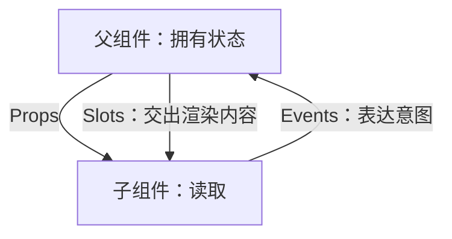

# Vue 3 组件通信、依赖注入与可复用组件

> 适用环境：Vue 3.5+、TypeScript 7.x、Vite。本节关注组件公共 API 和数据所有权，不把“少写几行代码”当作组件复用的唯一目标。

## 1. 学习目标

完成本节后，你应该能够：

- 使用 Props/Events 维护清晰的单向数据流。
- 区分初始值、受控值和本地状态。
- 理解组件事件不会自动冒泡。
- 正确设计 `v-model`、命名 model 和 modifiers。
- 控制 Attributes 与监听器的透传目标。
- 使用默认、具名和作用域 Slots 组合 UI。
- 理解 Slot 的作用域和渲染责任。
- 使用 `InjectionKey` 建立类型安全依赖注入。
- 将响应式写操作留在 Provider。
- 判断 Props、Provide/Inject、组合式函数和 Store 的适用范围。
- 设计可访问、可测试、职责稳定的基础组件。

## 2. 前置知识

建议先学习：

- [Composition API 与组件类型设计](/frontend/vue3/composition-api-and-component-typing)
- [响应式原理与副作用管理](/frontend/vue3/reactivity-and-effect-management)

同时应熟悉 Vue 2 Props、`$emit`、Slots 和 `v-model`。

## 3. 组件通信首先是所有权设计

开始写 API 前先回答：

- 谁拥有状态？
- 谁可以修改？
- 谁只需要读取？
- 变化是用户意图还是内部实现细节？
- 这个依赖只跨一层，还是跨越整个子树？



如果所有权不清晰，任何 API 都只能暂时掩盖问题。

## 4. Props 是单向向下绑定

```ts
interface Props {
  lesson: Lesson
  selected: boolean
}

const props = defineProps<Props>()
```

父组件更新后，新值流向子组件；子组件不能重写 Prop：

```ts
// 错误：Prop 是只读输入
// props.selected = true
```

单向数据流让写操作可以从父组件追踪，避免不同子组件暗中修改同一状态。

## 5. 嵌套 Props 的可变陷阱

对象和数组按引用传递，子组件技术上能修改嵌套属性：

```ts
// 技术上可能执行，但通常不应这样做
props.lesson.title = '被子组件修改'
```

Vue 无法在不付出高成本的情况下阻止所有深层修改。工程上应通过事件让拥有者执行更新：

```ts
emit('rename', {
  id: props.lesson.id,
  title: nextTitle
})
```

只有父子本就作为一个紧耦合实现单元时，才应例外并明确记录。

## 6. 初始值不是持续受控值

```ts
const props = defineProps<{
  initialPage: number
}>()

const page = ref(props.initialPage)
```

这里 `initialPage` 只用于初始化。本地 `page` 不会自动跟随父级后续变化。

命名应表达契约：

- `initialPage`：只取初值。
- `page`：通常表示持续由父组件控制。
- `defaultPage`：无受控值时使用的默认状态。

不要把“复制 Prop 到 ref”误认为双向同步。

## 7. 派生 Props 使用 computed

```ts
const normalizedTitle = computed(() =>
  props.title.trim()
)
```

如果本地值只是 Prop 的纯变换，不要通过 watcher 复制到另一个 ref。computed 能保持单一事实来源并自动响应父级变化。

## 8. 编辑草稿需要明确同步策略

表单组件常从 Prop 创建草稿：

```ts
const draft = reactive({
  title: props.lesson.title
})
```

必须明确父级 Prop 更新时怎么办：

- 覆盖未保存草稿。
- 仅在 ID 变化时重置。
- 若存在脏数据则提示冲突。
- 锁定编辑期间的源版本。

简单 `watch(props.lesson, Object.assign)` 不是所有编辑器的正确答案。

## 9. Events 表达子组件意图

```ts
const emit = defineEmits<{
  select: [lessonId: string]
  rename: [payload: { id: string; title: string }]
  remove: [lessonId: string]
}>()
```

事件名应描述业务事实或用户意图：

```ts
emit('select', props.lesson.id)
```

公共组件不必把每个内部按钮点击都原样转发。API 应稳定于内部 DOM 结构变化。

## 10. 组件事件不会冒泡

原生 DOM 事件会沿 DOM 树传播，Vue 组件自定义事件只由直接父组件监听：

```vue
<LessonRow @select="handleSelect" />
```

祖先不能期望在更上层自动捕获 `select`。跨多层通信应选择：

- 中间组件显式转发。
- Provide/Inject。
- 组合式上下文。
- 状态管理 Store。

不要建立隐式全局事件总线来恢复“冒泡感”。

## 11. 声明 Events 的运行时价值

声明 `emits` 不只提供类型提示。Vue 还能区分组件事件监听器和透传监听器，避免某些监听器意外落到根 DOM 元素。

公共组件应声明自己发出的事件，即使实现非常简单。

## 12. 事件载荷应避免泄露 DOM

不推荐让业务父组件处理子组件内部的原生事件：

```ts
emit('select', event)
```

更稳妥的是发送领域数据：

```ts
emit('select', props.lesson.id)
```

这样子组件从 `<button>` 改为键盘操作或菜单项时，父组件 API 不需要改变。

## 13. `v-model` 是 Prop + Event 协议

Vue 3.4+ 推荐：

```ts
const model = defineModel<string>({
  required: true
})
```

概念上等价于：

```text
modelValue Prop
update:modelValue Event
```

父组件：

```vue
<SearchInput v-model="query" />
```

它没有改变状态所有权，父组件仍拥有绑定值。

## 14. 命名 `v-model`

```ts
const title = defineModel<string>('title', {
  required: true
})

const published = defineModel<boolean>('published', {
  required: true
})
```

父组件：

```vue
<LessonFields
  v-model:title="title"
  v-model:published="published"
/>
```

多个 model 适合真正独立的受控值。若字段共同构成不可分割的领域对象，单个对象 model 或保存事件可能更一致。

## 15. `defineModel` 默认值风险

子组件声明默认值，而父级 ref 初始为 `undefined` 时，父子初值可能不同步。

公共组件优先：

- 使用 `required: true`。
- 由父组件初始化。
- 或明确记录无绑定值时的行为。

默认值的方便不能替代清晰的受控/非受控协议。

## 16. Model Modifiers

`defineModel()` 可以获得 modifiers，并用 `get`、`set` 转换：

```ts
const [model, modifiers] = defineModel<string>({
  set(value) {
    return modifiers.trim ? value.trim() : value
  }
})
```

父组件使用自定义 modifier：

```vue
<SearchInput v-model.trim="query" />
```

转换必须可预测，复杂验证和异步业务操作不应藏在 model setter 中。

## 17. 什么是 Fallthrough Attributes

未被组件声明为 Props 或 Events 的属性称为透传 Attributes，例如：

```vue
<BaseButton
  class="primary"
  aria-label="保存课程"
  @click="save"
/>
```

单根组件默认把它们继承到根元素。`class`、`style` 和监听器有合并行为，而不是简单覆盖。

## 18. 透传不是 API 设计的替代品

基础按钮将 `aria-*`、`data-*` 和原生监听器透传给 `<button>` 很有价值。

业务卡片若无意间把所有属性落在最外层 `<article>`，可能造成：

- `disabled` 落到不支持的元素。
- 点击监听绑定错误层级。
- 无障碍属性作用目标错误。
- 内部根元素变化破坏调用方。

透传目标是公共契约的一部分。

## 19. `inheritAttrs: false`

```ts
defineOptions({
  inheritAttrs: false
})
```

模板中显式放置：

```vue
<div class="field-shell">
  <input v-bind="$attrs" />
</div>
```

这适合包装原生控件：组件根负责布局，调用方 Attributes 应落到真正可交互的元素。

## 20. `useAttrs()`

```ts
const attrs = useAttrs()
```

它允许脚本访问透传 Attributes，但该对象不是为深度响应式业务状态设计的。如果逻辑依赖某个值并需要响应变化，应将它声明为显式 Prop。

属性名保留原始形式：例如 `foo-bar`，监听器常以 `onClick` 形式出现。

## 21. 多根组件不会自动选择透传目标

```vue
<template>
  <header>...</header>
  <main>...</main>
</template>
```

存在多个根节点时，Vue 无法决定 Attributes 应落到哪里。组件应显式 `v-bind="$attrs"`，否则开发环境会警告。

更重要的是：先决定哪个元素语义上应该接收属性，而不是随便选一个消除警告。

## 22. Props 与 Attributes 的边界

- 组件理解并参与业务逻辑的输入：声明为 Prop。
- 原生元素通用能力：可以透传。
- 组件承诺发出的事件：声明为 Emit。
- 不应支持的属性：不要因为 `$attrs` 方便而全部接受。

基础组件通常透传更多；业务组件通常应有更窄、更语义化的 API。

## 23. 默认 Slot

子组件提供插槽出口：

```vue
<button type="button">
  <slot>默认按钮文字</slot>
</button>
```

父组件提供内容：

```vue
<BaseButton>保存课程</BaseButton>
```

Slot 内容在父组件作用域中求值。子组件不能直接读取父级局部变量，除非通过 Slot Props 显式提供。

## 24. 具名 Slots

```vue
<article>
  <header><slot name="header" /></header>
  <section><slot /></section>
  <footer><slot name="actions" /></footer>
</article>
```

父组件：

```vue
<LessonCard>
  <template #header>课程标题</template>
  <p>课程说明</p>
  <template #actions>...</template>
</LessonCard>
```

具名 Slot 适合稳定布局区域，不应把每个内部标签都变成一个插槽。

## 25. 作用域 Slots

子组件向 Slot 提供数据和操作：

```vue
<slot
  :lesson="lesson"
  :selected="selected"
  :select="select"
/>
```

父组件：

```vue
<template #default="{ lesson, selected, select }">
  <button @click="select">
    {{ selected ? '已选择' : lesson.title }}
  </button>
</template>
```

子组件拥有行为，父组件拥有呈现，这就是无渲染或 Headless 组件的基础。

## 26. Slot Props 也是公共 API

```ts
defineSlots<{
  default(props: {
    lesson: Lesson
    selected: boolean
    select(): void
  }): unknown
}>()
```

重命名 Slot Prop 会影响所有调用方。它们应使用稳定的领域名称，而不是暴露内部 ref、DOM 或实现私有状态。

## 27. 条件 Slots 与 `$slots`

组件可根据调用方是否提供 Slot 决定是否渲染容器：

```vue
<footer v-if="$slots.actions">
  <slot name="actions" />
</footer>
```

这能避免空包装影响布局。不要用 `$slots` 猜测父组件业务状态，它只描述是否传入渲染函数。

## 28. Renderless 组件的取舍

无渲染组件通过作用域 Slot 复用逻辑，适合需要模板级控制的库组件。

在普通应用代码中，组合式函数往往更简单：

- 没有额外组件层级。
- TypeScript 输入输出更直接。
- 逻辑可在同一组件多个位置使用。

需要把逻辑与模板组合为声明式子树时，再选择 Headless 组件。

## 29. Props Drilling

一个深层后代需要祖先数据时，中间组件可能被迫重复声明和传递无关 Props：

```text
Workspace → Layout → Sidebar → Toolbar → Button
```

如果中间层不关心该依赖，这就是 Props Drilling。Provide/Inject 可以跨越中间层，但不应替代所有显式 Props。

## 30. Provide/Inject 的查找规则

祖先提供：

```ts
provide(key, value)
```

后代注入：

```ts
const value = inject(key)
```

如果多个祖先提供同一个键，距离最近的 Provider 生效。这允许子树覆盖主题、表单上下文或服务实现。

`provide()`、`inject()` 应在 `setup` 同步阶段调用，以关联当前组件实例。

## 31. 使用 `InjectionKey`

```ts
import type { InjectionKey, Ref } from 'vue'

interface LessonSelectionContext {
  selectedId: Readonly<Ref<string | null>>
  select(id: string): void
}

export const lessonSelectionKey = Symbol(
  'lesson-selection'
) as InjectionKey<LessonSelectionContext>
```

`Symbol` 避免字符串键冲突，`InjectionKey<T>` 同步 Provider 与 Consumer 的值类型。大型应用应把键和上下文接口放在独立模块。

## 32. `inject()` 为什么可能是 `undefined`

```ts
const context = inject(lessonSelectionKey)
// LessonSelectionContext | undefined
```

组件可能被放在 Provider 之外。可选依赖提供默认值；必需依赖应尽早失败：

```ts
if (!context) {
  throw new Error('LessonToolbar 必须位于 Provider 内')
}
```

无条件类型断言会把清晰的配置错误推迟到更远位置。

## 33. 将写操作留在 Provider

Provider：

```ts
const selectedId = ref<string | null>(null)

function select(id: string) {
  selectedId.value = id
}

provide(key, {
  selectedId: readonly(selectedId),
  select
})
```

Consumer 获得只读状态和明确操作。这样状态变化规则与状态所有权保持在一起，也便于日志、校验和测试。

## 34. 注入 ref 不会自动解包

Provider 提供 ref 时，Consumer 得到同一个 ref，不会由 `inject()` 自动解包：

```ts
const selectedId = inject(key)?.selectedId
selectedId?.value
```

这能维持与 Provider 的响应式连接。模板顶层绑定仍会按模板规则解包。

## 35. 应用级 Provide

```ts
app.provide(apiClientKey, apiClient)
```

适合插件、API Client、日志器和应用级服务。注意：

- 依赖对组件不再显式可见于 Props。
- 测试需要提供替身。
- SSR 应确保请求级状态不被全局单例污染。
- 业务状态规模变大后，Store 可能提供更好的调试体验。

## 36. Provide/Inject 不是全局 Store

Provide/Inject 适合组件子树上下文：

- 表单字段注册。
- 复合组件选择状态。
- 主题、语言和服务依赖。
- 父子树紧密协作。

以下情况更适合 Pinia 等 Store：

- 多个无共同近祖先的页面共享状态。
- 需要 DevTools 时间线和明确 action。
- 需要缓存、持久化和跨路由生命周期。

## 37. 选择通信方式

| 场景 | 推荐 |
| --- | --- |
| 直接父传子 | Props |
| 子向直接父表达意图 | Events |
| 单个受控值 | `v-model` |
| 父定制子渲染 | Slots |
| 深层子树上下文 | Provide/Inject |
| 复用无 UI 逻辑 | 组合式函数 |
| 跨页面共享业务状态 | Store |

不要用一个机制解决所有问题。清晰通常来自组合，而不是极端统一。

## 38. 基础组件与业务组件

基础组件：

- 接近原生语义。
- 支持合理 Attributes 透传。
- 有稳定无障碍契约。
- 事件和 Slots 较通用。

业务组件：

- API 使用领域词汇。
- 尽量不暴露内部 DOM。
- Attributes 透传更谨慎。
- 通过业务事件表达操作。

混淆两者会得到既不通用、又缺少领域约束的组件。

## 39. 可访问性是组件契约

包装原生输入时，必须保持：

- `label` 与控件关联。
- `disabled` 真正落到交互元素。
- `aria-describedby` 指向错误说明。
- 键盘与焦点行为符合原生预期。
- 错误状态通过 `aria-invalid` 表达。

透传 `$attrs` 应落到语义正确的元素，不只是视觉上的根节点。

## 40. 完整示例：课程选择复合组件

示例由四个 SFC 组成，页面直接导入完整源码。

### 可访问输入基础组件

```text
examples/frontend/vue3-components/BaseField.vue
```

<<< ../../../examples/frontend/vue3-components/BaseField.vue

### Selection Provider

```text
examples/frontend/vue3-components/LessonSelectionProvider.vue
```

<<< ../../../examples/frontend/vue3-components/LessonSelectionProvider.vue

### 深层 Toolbar Consumer

```text
examples/frontend/vue3-components/LessonToolbar.vue
```

<<< ../../../examples/frontend/vue3-components/LessonToolbar.vue

### 工作区组合

```text
examples/frontend/vue3-components/LessonCatalog.vue
```

<<< ../../../examples/frontend/vue3-components/LessonCatalog.vue

示例展示：

1. `inheritAttrs: false` 将 Attributes 放到真实 `<input>`。
2. `defineModel` 建立输入受控值。
3. Provider 使用 `InjectionKey`、只读状态和操作函数。
4. Consumer 对缺失 Provider 尽早报错。
5. 作用域 Slot 让父组件控制列表呈现。
6. 组件事件使用领域载荷而非 DOM Event。

## 41. 常见错误

### 子组件修改嵌套 Prop

技术上可行但写操作不可追踪。优先发事件给拥有者。

### 组件事件依赖冒泡

自定义事件只由直接父组件监听，不会跨组件层级自动传播。

### 所有字段都使用 `v-model`

会模糊状态所有权。只为真正受控、双向的值使用 model。

### 无条件透传 `$attrs`

属性和监听器可能落到错误 DOM 元素，导致语义和兼容性问题。

### Slot API 暴露内部实现

传递 DOM、内部 ref 或大量私有状态会让组件难以重构。

### 字符串注入键到处复制

容易冲突和拼写错误。公共上下文使用共享 `InjectionKey`。

### Consumer 直接修改注入状态

写规则散落。Provider 应暴露只读状态与命名操作。

### 用 Provide/Inject 代替所有 Props

直接父子依赖会变得隐藏，组件复用和测试更困难。

## 42. 工程最佳实践

- 先确定状态所有者，再设计通信方式。
- Props 保持只读，Events 表达领域意图。
- 编辑草稿明确源更新与冲突策略。
- model 只用于真正受控值，并谨慎处理默认值。
- 基础组件显式决定 Attributes 的透传目标。
- Slots 按稳定布局区域和领域能力设计。
- Slot Props 保持小而稳定。
- 深层子树上下文使用 `InjectionKey`。
- Provider 提供只读状态与写操作。
- 必需注入缺失时尽早抛出清晰错误。
- 跨页面业务状态使用专门 Store。
- 基础组件把无障碍行为作为测试目标。

## 43. Vue 2 迁移提示

- Vue 3 的组件 `v-model` 默认协议是 `modelValue` / `update:modelValue`。
- Vue 3 支持多个命名 `v-model`，无需 Vue 2 的 `.sync` 模式。
- Vue 2 的 `$listeners` 已合并进入 `$attrs`，事件监听器透传需要重新审查。
- 多根组件不会自动继承 Attributes。
- 不要用旧式全局 Event Bus 替代清晰组件通信。
- Mixins 中的隐式注入依赖应迁移为显式组合式函数或类型化上下文。

## 44. 面试知识

### 为什么 Props 是单向的？

让状态写操作集中在拥有者，避免子组件隐式修改父级状态，使数据变化更容易追踪。

### 组件事件会冒泡吗？

不会。自定义事件只能由直接父组件监听。

### `v-model` 的底层协议是什么？

默认是 `modelValue` Prop 和 `update:modelValue` Event；命名 model 使用对应名称。

### 什么是 Fallthrough Attributes？

传给组件但未声明为 Props 或 Events 的 Attributes，单根组件默认将其继承到根元素。

### 作用域 Slot 的作用域属于谁？

Slot 内容在父组件作用域求值，子组件通过 Slot Props 显式提供数据和操作。

### 为什么使用 `InjectionKey`？

它用 Symbol 避免键冲突，并让 TypeScript 同步 Provider 与 Consumer 的值类型。

### Provide/Inject 和 Store 如何选择？

前者适合一个组件子树的上下文；Store 适合跨页面或无共同近祖先的共享业务状态及调试需求。

## 45. 本节总结

- 组件通信本质是状态所有权与公共 API 设计。
- Props 单向向下，子组件通过 Events 表达意图。
- 嵌套 Props 虽可修改，工程上通常应避免。
- 组件事件不会冒泡。
- `v-model` 是 Prop 与更新事件协议。
- Fallthrough Attributes 必须落到语义正确的元素。
- 多根组件需要显式处理 Attributes。
- Slot 内容属于父作用域，Slot Props 是子组件公共 API。
- Provide/Inject 适合跨越中间组件的子树上下文。
- `InjectionKey` 提供防冲突和类型同步。
- Provider 应集中写操作，Consumer 使用只读状态和命名操作。
- Props、Events、Slots、Inject、组合式函数和 Store 各有边界。

## 46. 下一步学习

下一节建议学习：**Vue 3 Pinia 状态管理与服务层设计**。

将继续讲解 Setup Store、State/Getters/Actions、异步状态、Store 组合、解构响应式、服务层边界、SSR 与持久化注意事项。

## 47. 参考资料

- [Vue 官方指南：Props](https://vuejs.org/guide/components/props.html)
- [Vue 官方指南：Component Events](https://vuejs.org/guide/components/events.html)
- [Vue 官方指南：Component `v-model`](https://vuejs.org/guide/components/v-model.html)
- [Vue 官方指南：Fallthrough Attributes](https://vuejs.org/guide/components/attrs.html)
- [Vue 官方指南：Slots](https://vuejs.org/guide/components/slots.html)
- [Vue 官方指南：Provide / Inject](https://vuejs.org/guide/components/provide-inject.html)
- [Vue 官方指南：Composables](https://vuejs.org/guide/reusability/composables.html)
- [Vue TypeScript：Typing Provide / Inject](https://vuejs.org/guide/typescript/composition-api.html#typing-provide-inject)
