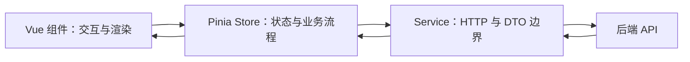

# Vue 3 Pinia 状态管理与服务层设计

> 适用环境：Vue 3、Pinia 3.x、TypeScript、Vite。本节假设你熟悉 Vue 2/Vuex，但不会把 Pinia 简化成“更轻的 Vuex”。

## 1. 学习目标

完成本节后，你应该能够：

- 判断局部状态、组合式函数、Provide/Inject 与 Store 的边界。
- 使用 Setup Store 组织 state、getters 与 actions。
- 正确解构 Store，同时保留响应式。
- 设计 loading、error、并发和取消请求状态。
- 将 HTTP、序列化和领域状态更新分层。
- 安全组合多个 Store，避免循环依赖。
- 理解组件外调用、SSR、水合与持久化的风险。
- 为 Store 建立可测试的业务 API。

## 2. 什么时候才需要 Store

Store 适合“跨越组件生命周期或组件树边界的业务状态”：

- 当前用户、权限与会话。
- 购物车、跨步骤表单草稿。
- 多页面共同编辑的实体缓存。
- 需要 DevTools 时间线追踪的业务变更。

以下状态通常不值得放进全局 Store：

- 菜单是否展开、输入框是否聚焦。
- 只服务一个组件的临时校验消息。
- 能从 Props 或路由立即计算出的重复数据。
- 单纯为了避免一层 Props 而提升的状态。

Store 不是“所有 ref 的仓库”。状态离使用位置越远，生命周期、失效、并发与测试成本越高。

## 3. 四种共享方式的选择

| 方案 | 适合范围 | 生命周期 | 典型场景 |
| --- | --- | --- | --- |
| 组件本地状态 | 单组件 | 组件实例 | 展开、焦点、局部草稿 |
| 组合式函数 | 复用行为；是否共享取决于状态定义位置 | 组件或模块 | 请求逻辑、媒体查询 |
| Provide/Inject | 一个组件子树 | Provider 实例 | 表单、Tabs、主题上下文 |
| Pinia Store | 跨树、跨页面业务状态 | Pinia 实例 | 用户、购物车、实体缓存 |

模块顶层 `ref()` 会成为客户端单例，并可能在 SSR 中跨请求共享。不要把它当作“不安装 Pinia 的简易 Store”。

## 4. 安装顺序与 Store 实例

```ts
const app = createApp(App)
const pinia = createPinia()

app.use(pinia)
app.mount('#app')
```

`defineStore()` 返回的是 `useXxxStore` 函数；调用它才会取得当前 Pinia 实例中的 Store。Store ID 必须在应用内唯一，Pinia 用它连接 DevTools 等能力。

完整入口代码：

<<< ../../../examples/frontend/vue3-pinia/main.mts

示例使用 `.mts` 表示 ESM TypeScript；常规 Vite 项目也可使用 `.ts` 文件。

## 5. Option Store 与 Setup Store

Option Store 的结构接近 Vuex：

```ts
defineStore('counter', {
  state: () => ({ count: 0 }),
  getters: {
    doubled: (state) => state.count * 2
  },
  actions: {
    increment() {
      this.count += 1
    }
  }
})
```

Setup Store 使用 Composition API：

```ts
defineStore('counter', () => {
  const count = ref(0)                       // state
  const doubled = computed(() => count.value * 2) // getter
  function increment() { count.value += 1 } // action

  return { count, doubled, increment }
})
```

两种写法没有“高级与低级”之分。Option Store 约束更明确；Setup Store 更适合组合 composable、watcher 和复杂类型。团队应按一致性与需求选择。

## 6. Setup Store 必须返回完整状态

在 Setup Store 中：

- `ref()` 对应 state。
- `computed()` 对应 getter。
- 函数对应 action。

所有业务 state 都应返回。隐藏响应式 state 或把它改成只读后再返回，会破坏 SSR、水合、DevTools 和插件对状态树的理解。

未返回的普通变量可以作为实现细节，例如请求序号与 `AbortController`；它们不应是需要序列化或恢复的业务状态。

## 7. 不要直接解构 Store 状态

Store 本身是 `reactive` 对象。直接解构会像解构普通 reactive 对象一样丢失连接：

```ts
const store = useLessonStore()
const { loading } = store // 不再随 Store 更新
```

状态和 getters 使用 `storeToRefs()`：

```ts
const { loading, items, publishedCount } = storeToRefs(store)
```

Actions 不是响应式值，可以直接解构：

```ts
const { load, select } = store
```

`toRefs(store)` 会把 actions 也包装，`storeToRefs()` 则会跳过非响应式属性，更符合 Store 使用语义。

## 8. State 只保存最小事实

课程示例保存：

- API 返回的 `items`。
- 查询条件 `keyword`、`status`。
- 选择标识 `selectedId`。
- 请求状态 `loading`、`publishing`、`error`。

“已发布数量”和“选中课程对象”是纯派生数据，使用 computed，不再存一份可失效副本。

```ts
const selectedLesson = computed(
  () => items.value.find(item => item.id === selectedId.value) ?? null
)
```

优先保存实体 ID 而不是复制完整选中对象，可避免列表更新后详情仍指向旧对象。

## 9. Actions 是业务操作边界

好的 action 表达业务意图：

```ts
await store.publishSelected()
```

而不是要求组件编排底层步骤：

```ts
// 组件不应知道这些实现细节
store.publishing = true
const result = await api.publish(store.selectedId)
store.items[index] = result
store.publishing = false
```

Pinia 允许直接修改 state，这对简单表单很实用；跨多个字段、包含错误恢复的操作仍应进入 action，以便复用、测试和追踪。

## 10. 异步 Action 的完整状态机

一个可靠请求至少有四个结果：

```text
idle → pending → success
               ↘ error
               ↘ cancelled / stale
```

仅用一个 `loading` 不足以解决：

- 前一个请求晚于后一个返回，覆盖新结果。
- 组件重复提交同一写操作。
- 取消请求被误显示成错误。
- 旧请求的 `finally` 提前关闭新请求的 loading。

本课使用两层保护：

1. `AbortController` 主动取消旧查询，节省无用工作。
2. 单调递增的请求序号阻止旧结果和旧 `finally` 提交状态。

即使底层客户端不支持取消，请求序号仍能保护提交顺序。

## 11. 读请求与写请求分开建模

`loading` 表示列表查询，`publishing` 表示发布动作。不要让一个布尔值代表所有网络活动，否则查询与发布并发时，任一请求结束都会错误关闭全局 loading。

大型应用可使用按操作命名的状态：

```ts
const pending = reactive({
  list: false,
  publish: new Set<string>()
})
```

设计粒度取决于 UI 是否需要独立禁用和反馈。

## 12. 服务层不等于 Store

服务层负责 I/O 边界：

- URL、HTTP 方法、Headers。
- DTO 序列化与运行时解析。
- `AbortSignal`、超时和错误归一化。
- 与 Vue 无关的接口调用。

Store 负责应用状态与业务流程：

- 当前筛选条件和选择。
- 何时加载、结果是否仍有效。
- 成功后如何更新状态树。
- 错误如何暴露给界面。

组件负责交互与展示：

- 表单提交、按钮点击。
- loading、错误、空状态的视觉语义。
- 可访问性与焦点管理。



## 13. 完整服务层示例

下面用可取消的内存 API 模拟网络层。真实项目可将函数体替换为 `fetch`，Store 与组件契约无需改变。

<<< ../../../examples/frontend/vue3-pinia/lesson-api.mts

生产代码还应在服务层验证不可信响应。TypeScript 类型不会验证运行时 JSON，必要时使用手写 type guard 或 schema validator。

## 14. 完整 Setup Store 示例

<<< ../../../examples/frontend/vue3-pinia/lesson-store.mts

注意这些细节：

- Store ID `lessons` 稳定且唯一。
- 所有业务 ref 和 computed 都被返回。
- 控制器和请求序号仅是不可序列化的实现细节。
- 取消不是用户错误，不写入 `error`。
- 更新列表项时用服务返回的新实体替换旧实体。
- Setup Store 自己实现 `$reset()`，同时使在途读取失效。

## 15. 完整组件示例

<<< ../../../examples/frontend/vue3-pinia/LessonStorePage.vue

组件只编排交互：通过 `storeToRefs()` 读取响应式状态，通过 action 触发业务操作。模板不直接调用 API，也不手动修补 Store 内部状态。

## 16. `$patch`、直接修改与 Actions

Pinia 支持：

```ts
store.keyword = 'Vue'

store.$patch({
  keyword: '',
  status: 'all'
})

store.$patch((state) => {
  state.items.push(nextLesson)
})
```

选择原则：

- 单个简单受控字段可直接修改。
- 同一用户操作修改多个字段时，`$patch` 可形成一个 DevTools 记录。
- 有业务规则、异步流程或复用需求时使用命名 action。

不要仅为“禁止直接修改”包一层没有语义的 setter；也不要让组件复制复杂 action 的流程。

## 17. `$reset` 的差异

Option Store 内置 `$reset()`，会用 `state()` 创建新状态。Setup Store 必须自行实现，因为 Pinia 无法猜测每个 ref 的初始语义。

重置不只是把字段设回默认值，还要考虑：

- 取消在途请求。
- 使未取消但仍可能返回的结果失效。
- 清空实体缓存和选择。
- 是否保留用户偏好筛选。

退出登录时的“重置全部 Store”通常适合 Pinia 插件或显式会话编排器，而不是组件逐个调用。

## 18. Store 组合

一个 Store 可以调用另一个 Store：

```ts
export const useOrderStore = defineStore('orders', () => {
  const session = useSessionStore()

  async function submit() {
    await orderService.create({ token: session.token })
  }

  return { submit }
})
```

约束是不能让两个 Setup Store 在初始化顶层互相读取对方状态，否则会形成循环。双向协作时，把读取推迟到 computed 或 action，并重新审视是否应提取第三个 Store/服务。

异步 action 内调用其他 `useStore()` 时，应在第一次 `await` 前取得 Store；SSR 下异步上下文变化可能导致绑定到错误的 Pinia 实例。

## 19. 组件外使用 Store

SPA 中，以下模块顶层调用可能发生在 `app.use(pinia)` 之前：

```ts
// 危险：结果取决于模块导入顺序
const session = useSessionStore()
```

在路由守卫等回调内部延迟调用：

```ts
router.beforeEach((to) => {
  const session = useSessionStore()
  if (to.meta.requiresAuth && !session.loggedIn) return '/login'
})
```

SSR 或多应用实例中应显式传入对应 `pinia`：

```ts
const session = useSessionStore(pinia)
```

这不是类型问题，而是 Store 属于哪个应用实例的问题。

## 20. SSR 与水合

SSR 的核心规则是“每个请求拥有自己的应用和 Pinia 实例”。把 Pinia 放在服务器模块全局会泄露用户状态。

服务端渲染后的状态需要安全序列化到 HTML，再在客户端首次调用 Store 前完成水合。包含用户输入的 JSON 若未经正确转义直接嵌入 `<script>`，可能造成 XSS。应使用框架提供的机制或安全序列化库，而不是字符串拼接。

不要把以下值当成可水合 state：

- `AbortController`、DOM 节点。
- WebSocket、数据库连接。
- 函数、Promise。
- 依赖浏览器全局的对象。

它们应是客户端资源或 Store 内部实现细节。

## 21. 持久化不是默认能力

Pinia 核心不会自动把 Store 写入 `localStorage`。持久化插件也不能替你决定：

- 哪些字段能存，哪些是敏感信息。
- 数据版本升级和迁移策略。
- 多标签页冲突。
- 服务端与客户端初值冲突。
- 过期时间与退出登录清理。

Token、权限结论、完整用户资料不应因为“恢复方便”就无条件落盘。优先让服务端会话成为事实来源，只持久化确有价值且可接受泄露风险的最小字段。

## 22. 订阅与副作用

`store.$subscribe()` 适合审计、持久化适配器等 Store 级监听；`store.$onAction()` 可观察 action 的开始、成功和失败。

业务流程不要全部藏在订阅器中。若“发布成功后刷新列表”是明确业务规则，直接写在 action 或服务编排中通常更可读、更可测试。

订阅默认也受创建它的组件生命周期影响；应用级订阅要明确清理与 detached 生命周期，避免热更新和测试中重复注册。

## 23. 错误设计

`error: string | null` 适合教学小例子，复杂项目应区分：

```ts
type RequestError =
  | { kind: 'unauthorized' }
  | { kind: 'validation'; fields: Record<string, string> }
  | { kind: 'network'; retryable: boolean }
  | { kind: 'unexpected'; message: string }
```

服务层把 HTTP/SDK 错误归一化；Store 决定业务后果；组件决定如何呈现。不要在底层服务直接弹 Toast，也不要把未知服务错误对象原样塞进可序列化 state。

## 24. 缓存与失效

Store 中保存 API 数据就形成了客户端缓存，必须回答：

- 数据何时过期？
- 路由返回时复用还是重取？
- 写操作后局部更新还是整体失效？
- 相同查询是否去重？
- 后台刷新时是否保留旧界面？

若项目大量处理服务端状态、缓存键、重试和失效，可评估专门的数据请求库；Pinia 更适合客户端业务状态和明确的跨组件流程。不要无边界地重造查询缓存框架。

## 25. Store 测试边界

单元测试每例创建新的 Pinia：

```ts
beforeEach(() => {
  setActivePinia(createPinia())
})
```

重点验证可观察行为：

- 初始状态与 getters。
- action 成功/失败后的状态。
- 新查询是否阻止旧结果覆盖。
- `$reset()` 是否取消并清理状态。
- 服务层 mock 的调用参数。

组件测试可用 `@pinia/testing` 创建测试 Pinia。注意其 actions 默认可能被 stub；要测试真实 action 流程时需显式配置。依赖 Pinia 插件的 Store，测试中也必须安装插件到应用实例。

## 26. 常见反模式

### 把所有 API 数据永久塞进一个 Store

会形成巨型状态、模糊失效策略，并让任意页面依赖任意字段。应按领域与生命周期拆分。

### 直接解构 Store

导致 state/getters 失去响应式连接。使用 `storeToRefs()`。

### 用 watcher 双向同步两份事实

两个 Store 各保存同一实体，再互相 watcher，容易形成循环和瞬时不一致。建立单一所有者或规范化实体缓存。

### Action 只负责调用 API

若组件仍处理 loading、错误和状态提交，业务流程依然散落。Action 应完成一个可观察的业务操作。

### Store 直接操作 DOM 或路由展示

Store 不应读取具体元素或弹 UI；通过返回结果、状态或领域错误交给界面处理。

### 把派生值写回 state

例如同时保存 `items` 与 `itemCount`，每次变更都要同步。纯派生值使用 getter/computed。

## 27. Vuex 迁移提示

- 不再需要 mutations；同步与异步变更都放入 actions 或直接修改。
- 不要机械创建一个根 Store；按领域拆分多个唯一 ID Store。
- `mapState` 等 Options API helper 可继续使用，但新组件优先 Composition API。
- Vuex module namespace 不等同于 Pinia Store ID，迁移时重新设计边界。
- Setup Store 的 ref 在 Store 实例上会自动解包，但在 Store 内部仍使用 `.value`。
- Vuex 插件、持久化与审计逻辑需要按 Pinia 插件生命周期重新验证。

## 28. 工程检查清单

- Store 是否解决真实的跨树/跨页面状态问题？
- Store ID 是否稳定且唯一？
- Setup Store 是否返回全部业务 state？
- 组件是否用 `storeToRefs()` 解构状态？
- 派生数据是否保持为 computed/getter？
- 每种异步操作是否有独立 pending/error 语义？
- 是否处理取消、乱序响应和重复提交？
- HTTP 与 DTO 细节是否留在服务层？
- Store 间是否存在初始化循环？
- SSR 是否每请求创建 Pinia，且安全序列化状态？
- 持久化字段是否最小、可迁移且不敏感？
- 测试是否为每例创建隔离 Pinia？

## 29. 面试知识

### 为什么不能直接解构 Pinia Store？

Store 是 reactive 对象，直接取出属性会失去响应式访问路径。state 和 getters 应通过 `storeToRefs()` 转为 refs；actions 可以直接解构。

### Setup Store 与 Option Store 如何选择？

Option Store 结构明确、接近传统 Store；Setup Store 组合能力更强。两者能力都足够，应依据复杂度与团队一致性选择。

### Pinia 为什么没有 mutations？

Vue 3 的响应式与 DevTools 已能追踪直接变更，额外 mutation 层不再是必要约束。复杂操作仍应通过 action 表达业务意图。

### 如何避免搜索请求竞态？

主动取消旧请求，并用请求 ID/序号在提交结果和 `finally` 前确认当前请求仍是最新。

### Store 和服务层有什么区别？

Store 管理应用状态与业务流程；服务层管理 I/O、HTTP、DTO 和运行时边界。服务层不应依赖 Vue 组件状态。

### SSR 中为什么不能复用全局 Pinia？

服务器同时处理多个用户请求，全局实例会让状态跨请求泄露。每个请求必须有独立应用与 Pinia。

## 30. 本节总结

- Pinia Store 用于跨组件树和跨页面的共享业务状态。
- Setup Store 的 ref、computed、函数分别对应 state、getter、action。
- 全部业务 state 必须返回；不可序列化资源只作为实现细节。
- `storeToRefs()` 保持 state/getters 解构后的响应式。
- Action 应封装完整业务状态机，而非只代理 API。
- 取消与请求序号共同避免乱序响应污染状态。
- 服务层负责 I/O，Store 负责状态和业务流程，组件负责交互呈现。
- Store 组合要避免初始化循环，SSR 要绑定正确 Pinia 实例。
- 持久化、缓存与订阅都需要显式生命周期和安全策略。

## 31. 下一步学习

下一节建议学习：**Vue Router 4 与前端路由架构**。

将继续讲解动态路由、嵌套路由、路由级数据加载、导航守卫、权限边界、URL 状态、代码分割与组件生命周期。

## 32. 参考资料

- [Pinia 官方指南：Defining a Store](https://pinia.vuejs.org/core-concepts/)
- [Pinia 官方指南：State](https://pinia.vuejs.org/core-concepts/state.html)
- [Pinia 官方指南：Getters](https://pinia.vuejs.org/core-concepts/getters.html)
- [Pinia 官方指南：Actions](https://pinia.vuejs.org/core-concepts/actions.html)
- [Pinia 官方指南：Stores outside of components](https://pinia.vuejs.org/core-concepts/outside-component-usage.html)
- [Pinia 官方指南：Server Side Rendering](https://pinia.vuejs.org/ssr/)
- [Pinia Cookbook：Composing Stores](https://pinia.vuejs.org/cookbook/composing-stores.html)
- [Pinia Cookbook：Testing stores](https://pinia.vuejs.org/cookbook/testing.html)
- [Vue 官方指南：TypeScript with Composition API](https://vuejs.org/guide/typescript/composition-api.html)
