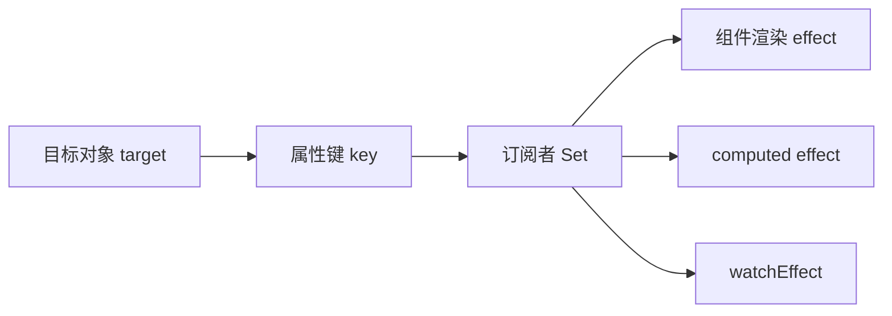
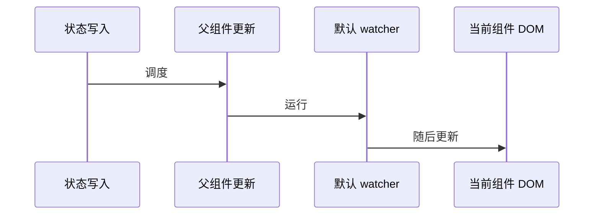

# Vue 3 响应式原理与副作用管理

> 适用环境：Vue 3.5+、TypeScript 7.x、Vite。本文使用简化伪代码解释原理，真实 Vue 实现还包含调度、缓存、集合类型和大量边界处理。

## 1. 学习目标

完成本节后，你应该能够：

- 理解响应式系统的依赖、订阅者、收集和触发。
- 解释 Vue 3 为什么对对象使用 Proxy、对 ref 使用访问器。
- 理解响应式 Proxy 与原始对象的身份差异。
- 掌握 `ref` 在对象、数组与模板中的解包边界。
- 区分深层与浅层响应式、只读和原始值逃生舱。
- 正确选择 `computed`、`watch` 与 `watchEffect`。
- 使用监听清理避免过期请求和资源泄漏。
- 理解 `pre`、`post`、`sync` 刷新时机。
- 控制深度监听的正确性和性能成本。
- 识别第三方状态、不可变数据和大型数据结构的集成方式。

## 2. 前置知识

建议先学习：[Vue 3 Composition API 与组件类型设计](/frontend/vue3/composition-api-and-component-typing)。

同时应熟悉 JavaScript 对象身份、Proxy、闭包、异步请求和事件循环。

## 3. 什么是响应式

普通 JavaScript 只计算一次：

```ts
let price = 100
let quantity = 2
let total = price * quantity

price = 120
console.log(total) // 仍然是 200
```

响应式系统希望建立关系：读取 `price`、`quantity` 的计算，应在它们变化后失效或重新执行。

```text
状态读取 → 收集依赖 → 状态写入 → 通知订阅者 → 调度更新
```

## 4. Effect、依赖与订阅者

假设渲染函数读取两个状态：

```ts
function render() {
  view.textContent = `${price.value * quantity.value}`
}
```

- `render` 是产生副作用的 effect。
- `price.value` 和 `quantity.value` 是 effect 的依赖。
- effect 是这些依赖的订阅者。

第一次执行时收集依赖，后续依赖变化时触发 effect。Vue 的组件渲染、计算属性和 watcher 都建立在响应式 effect 之上。

## 5. 简化的依赖存储结构

概念上可以想象为：

```ts
WeakMap<target, Map<key, Set<effect>>>
```



`WeakMap` 让目标对象不再被其他地方引用时仍可被垃圾回收。真实实现还要处理嵌套 effect、调度与重复触发。

## 6. `track()` 与 `trigger()`

简化伪代码：

```ts
function get(target: object, key: PropertyKey) {
  track(target, key)
  return Reflect.get(target, key)
}

function set(
  target: object,
  key: PropertyKey,
  value: unknown
) {
  Reflect.set(target, key, value)
  trigger(target, key)
}
```

- `track` 在存在当前活动 effect 时记录订阅关系。
- `trigger` 找到对应属性的订阅者并调度它们。

并非每次写入都会立刻同步重新渲染；Vue 会批处理组件更新和多数 watcher。

## 7. Vue 2 与 Vue 3 的核心差异

Vue 2 主要通过 `Object.defineProperty` 的 getter/setter 拦截已存在属性。Vue 3 对响应式对象使用 Proxy，可以拦截：

- 属性读取与写入。
- 新增和删除属性。
- `in` 检查。
- 键遍历。
- 数组与集合操作。

因此 Vue 3 不再需要 Vue 2 的 `Vue.set()`、`Vue.delete()` 来通知新增或删除属性。

## 8. `reactive()` 返回 Proxy

```ts
const raw = { count: 0 }
const state = reactive(raw)

state !== raw // true
```

应把返回的 Proxy 当成主要状态入口：

```ts
state.count++ // 能被追踪
raw.count++   // 绕过 Proxy，不会触发相同更新路径
```

不要保留原始对象并在不同位置混合修改，这会让状态变化难以预测。

## 9. 同一原始对象的 Proxy

对同一对象重复调用 `reactive()`，Vue 会复用对应 Proxy；对已经是 Proxy 的值再次调用通常也返回它自身。

但业务代码不应依赖到处重复包装。更清晰的做法是在状态所有权边界创建响应式对象，然后传递该响应式引用。

## 10. Proxy 身份陷阱

如果外部库按对象身份查找：

```ts
const rawLesson = { id: 'vue-02' }
const lesson = reactive(rawLesson)

new Set([rawLesson]).has(lesson) // false
```

集合键、缓存键和第三方实例应使用稳定 ID，或明确决定保存原始对象还是 Proxy。不要随意用 `toRaw()` 修补每个比较点。

## 11. `toRaw()` 是临时逃生舱

```ts
const original = toRaw(state)
```

它可用于临时读取、序列化边界或与不接受 Proxy 的 API 集成。长期持有并修改原始对象会绕开响应式系统。

原则是：短暂取出、不要把 raw 作为第二份可变事实来源。

## 12. `ref()` 的工作方式

JavaScript 无法拦截局部变量的普通读写，所以 ref 使用值容器：

```ts
const count = ref(0)
count.value++
```

概念伪代码：

```ts
const refObject = {
  get value() {
    track(refObject, 'value')
    return value
  },
  set value(next) {
    value = next
    trigger(refObject, 'value')
  }
}
```

`.value` 使读取与写入可以被拦截，也是 Vue 运行时响应式的显式边界。

## 13. ref 包装对象时默认是深层的

```ts
const lesson = ref({
  title: '响应式原理',
  author: { name: 'Ada' }
})

lesson.value.author.name = 'Lin'
```

普通 `ref` 会把对象值转换成深层响应式对象。整体替换 `lesson.value` 也会触发订阅。

若对象很大、由外部系统管理或采用不可变更新，应考虑 `shallowRef()`。

## 14. 模板自动解包边界

顶层 ref 在模板表达式中通常自动解包：

```vue
<p>{{ count }}</p>
```

但不要把“模板会解包”扩展成“任意嵌套位置都和普通值完全一样”。数组、集合、嵌套对象和 JavaScript 脚本中的规则不同。

团队应把 `.value` 看成脚本中的正常语义，而不是必须消除的噪声。

## 15. reactive 对象中的 ref 解包

```ts
const count = ref(0)
const state = reactive({ count })

state.count // number
state.count = 1
count.value // 1
```

普通响应式对象属性会对 ref 自动解包并保持连接。但响应式数组和原生集合中的 ref 不会采用同样的属性解包方式：

```ts
const list = reactive([ref(1)])
list[0]?.value
```

跨边界时应根据实际容器规则访问，不依靠模糊记忆。

## 16. 响应式断开连接

```ts
const state = reactive({ count: 0 })
let { count } = state

count++
```

局部 `count` 的读取写入不再经过 Proxy。断开的是变量绑定；如果解构出的值本身是对象并继续修改其属性，该嵌套对象仍可能是 Proxy。

需要保持属性连接时使用 `toRef()`、`toRefs()` 或直接访问 `state.count`。

## 17. `readonly()` 仍是 Proxy

```ts
const state = reactive({ count: 0 })
const publicState = readonly(state)
```

`publicState` 会随源状态更新，但调用方不能通过它写入。适合组合式函数公开“读状态 + 写操作”：

```ts
return {
  state: readonly(state),
  increment
}
```

它是运行时只读代理与 TypeScript 类型约束的组合，但不能阻止调用方通过仍持有的其他可变引用修改同一源对象。

## 18. `shallowRef()`

```ts
const snapshot = shallowRef({
  lessons: [] as Lesson[]
})
```

只有 `.value` 访问是响应式的，内部对象保持原样：

```ts
snapshot.value.lessons.push(lesson)
// 不会因深层修改自动触发依赖

snapshot.value = {
  lessons: [...snapshot.value.lessons, lesson]
}
// 替换 .value 会触发
```

适合大型不可变数据、第三方状态机和另一个 Proxy 系统管理的状态。

## 19. `shallowReactive()`

```ts
const state = shallowReactive({
  status: 'idle',
  payload: largeExternalObject
})
```

只有根属性响应式，嵌套值保持原始。它适合明确的根级状态容器，不应嵌套在深层响应式树中，否则会形成难以解释的不一致行为。

## 20. `markRaw()`

```ts
const chart = markRaw(new ChartEngine())
const state = reactive({ chart })
```

`markRaw()` 阻止对象被转换为 Proxy，常用于：

- 复杂第三方类实例。
- 不应被代理的组件或渲染对象。
- 大型不可变结构的特定节点。

这是显式逃生舱，不应作为默认性能优化。嵌套对象仍可能产生身份问题，需要理解真实数据结构。

## 21. 深层响应式不是免费午餐

深层转换通常是按访问发生，但大型列表和深层树仍会增加代理、追踪与遍历成本。

优化前先测量：

- 状态是否真的很大。
- 组件渲染是否读取大量深层属性。
- 数据是否天然采用不可变更新。
- 第三方库是否已经管理响应式。

普通业务表单不必因为担心 Proxy 就全部改为浅层 API。

## 22. `computed()` 是带缓存的响应式 effect

```ts
const visibleLessons = computed(() =>
  lessons.value.filter(lesson =>
    lesson.title.includes(query.value)
  )
)
```

依赖未变化时，重复读取通常复用缓存。依赖变化后先标记失效，在下次读取时重新计算。

计算 getter 应保持纯粹。发送请求、写本地存储和修改其他状态属于副作用，不应藏进 computed。

## 23. 计算稳定性与对象返回值

如果 computed 每次重新计算都创建新对象，下游会看到新身份：

```ts
const summary = computed(() => ({
  total: lessons.value.length,
  published: lessons.value.filter(item => item.published).length
}))
```

不要为微小对象过早优化，但在高频、昂贵下游处理中应关注返回身份。更根本的策略是减少无关依赖读取和拆分派生值。

## 24. `watch()` 的来源

`watch` 可监听：

- ref 或 computed ref。
- reactive 对象。
- 返回响应式值的 getter。
- 多个来源组成的数组。

```ts
watch(query, handleQuery)

watch(
  () => filters.page,
  handlePage
)

watch([query, () => filters.page], handleSearch)
```

不能直接传递 `filters.page`，因为调用时得到的只是普通数字。

## 25. `watch()` 默认是浅层的

Getter 返回对象时，默认只在返回引用被替换后触发：

```ts
watch(
  () => state.filters,
  handleReplacement
)
```

直接监听 reactive 对象会隐式进行深度监听：

```ts
watch(state.filters, handleNestedChange)
```

两者语义不同，应根据“关心对象替换”还是“关心内部任意变化”选择。

## 26. 深度监听的身份与成本

```ts
watch(
  () => state.filters,
  (current, previous) => {
    // 仅嵌套属性变化时，两者可能是同一个对象
  },
  { deep: true }
)
```

深度监听需要遍历嵌套属性，大型结构可能昂贵。Vue 3.5 支持数字深度：

```ts
watch(source, callback, { deep: 2 })
```

优先监听真正需要的字段，或使用不可变替换让变更边界更明确。

## 27. `watchEffect()` 的自动依赖

```ts
watchEffect(() => {
  console.log(query.value, filters.page)
})
```

同步执行期间读取的响应式值会自动成为依赖。它简洁，但依赖列表隐含在函数体中。

异步回调只会追踪第一次 `await` 之前同步读取的依赖。需要精确异步来源时，`watch` 通常更适合。

## 28. `watch` 与 `watchEffect` 的选择

| 需求 | 推荐 |
| --- | --- |
| 明确来源与新旧值 | `watch` |
| 多个紧密相关依赖，立即执行 | `watchEffect` |
| 控制是否首次执行 | `watch` + `immediate` |
| 只执行一次 | `watch` + `once` |
| 纯派生值 | `computed` |
| DOM 更新后的测量 | `watch` + `flush: 'post'` |

如果 watcher 只是把 A 复制到 B，应先检查 B 是否本可由 computed 得到。

## 29. Watcher 默认刷新时机

Vue 会批处理用户 watcher 与组件更新。默认 watcher：

1. 在父组件更新之后运行。
2. 在所属组件 DOM 更新之前运行。

因此默认回调中读取当前组件 DOM，看到的可能是更新前状态。



## 30. `flush: 'post'`

需要测量更新后的 DOM：

```ts
watch(
  results,
  () => {
    const height = listElement.value?.offsetHeight
    console.log(height)
  },
  { flush: 'post' }
)
```

也可以使用 `watchPostEffect()`。它表达的是调度阶段，不保证浏览器已经完成绘制；动画与布局场景还要理解渲染帧。

## 31. `flush: 'sync'`

同步 watcher 在检测到变化时立即运行，不经过批处理：

```ts
watch(flag, callback, { flush: 'sync' })
```

它只适合简单、低频且确实要求同步的状态。对可能同步修改很多次的数组或对象使用，会造成大量重复执行。

不要用 `sync` 修复没有理解的更新时序。

## 32. 立即与单次监听

```ts
watch(source, callback, {
  immediate: true,
  once: true
})
```

- `immediate` 在创建 watcher 时立即执行一次。
- `once` 在来源首次变化后停止。

组合行为应通过实际版本文档和测试确认。对于“初始化加载 + 后续持续更新”，通常只使用 `immediate`。

## 33. 清理过期异步请求

```ts
watch(query, newQuery => {
  const controller = new AbortController()

  onWatcherCleanup(() => controller.abort())

  void fetch(`/api/search?q=${encodeURIComponent(newQuery)}`, {
    signal: controller.signal
  })
})
```

来源再次变化或 watcher 停止时，旧请求被取消，避免过期结果覆盖最新状态。

Vue 3.5 的 `onWatcherCleanup()` 必须在回调同步执行阶段调用，不能放到 `await` 之后。

## 34. `onCleanup` 参数

```ts
watch(query, async (newQuery, _oldQuery, onCleanup) => {
  const controller = new AbortController()
  onCleanup(() => controller.abort())

  await fetch(`/api/search?q=${newQuery}`, {
    signal: controller.signal
  })
})
```

回调参数形式与 watcher 实例绑定，适合需要兼容旧版本或在异步函数中组织清理的代码。无论使用哪种方式，都应在启动副作用后立刻注册清理。

## 35. Loading 状态也有竞态

旧请求被取消后，它的 `finally` 可能把最新请求的 `loading` 改成 `false`。可使用请求序号：

```ts
let requestId = 0

watch(query, async value => {
  const currentId = ++requestId
  loading.value = true

  try {
    await search(value)
  } finally {
    if (currentId === requestId) {
      loading.value = false
    }
  }
})
```

AbortController 与请求身份检查解决不同层次的问题，可以组合使用。

## 36. Watcher 的自动停止边界

在 `setup()` 或 `<script setup>` 同步创建的 watcher 会绑定组件实例，并在卸载时自动停止。

如果在异步回调中晚些创建 watcher，它可能没有自动绑定，需要手动保存停止句柄：

```ts
const stop = watch(source, callback)
stop()
```

更好的方式通常是同步创建 watcher，并在回调内部根据条件提前返回。

## 37. `effectScope()`

可复用逻辑可能同时创建多个 computed 和 watcher。`effectScope()` 能把它们收集到一个作用域：

```ts
const scope = effectScope()

scope.run(() => {
  watch(sourceA, callbackA)
  watchEffect(effectB)
})

scope.stop()
```

适合组件外的复杂响应式服务、插件和测试清理。普通组件内同步创建的 effect 已由组件作用域管理，不必重复包装。

## 38. `onScopeDispose()`

组合式函数可以注册当前 effect scope 的清理：

```ts
export function useExternalSubscription() {
  const unsubscribe = externalStore.subscribe(handleChange)
  onScopeDispose(unsubscribe)
}
```

它让组合式函数不必只依赖组件卸载钩子，也能在自定义 effect scope 中正确清理。

## 39. 响应式调试

开发环境可以使用：

- `onRenderTracked()`：查看渲染收集了哪些依赖。
- `onRenderTriggered()`：查看哪个变更触发渲染。
- computed 的 `onTrack`、`onTrigger`。
- watcher 的 `onTrack`、`onTrigger`。

这些钩子只用于开发调试。先在回调中放置 `debugger`，检查目标、键与操作类型，而不是把大量日志长期留在业务代码中。

## 40. 与外部状态系统集成

外部状态库可能已经使用 Proxy、不可变树或自己的订阅系统。不要再对内部值做深层 `reactive()`。

通用桥接方式：

```ts
const externalState = shallowRef(store.getState())

const unsubscribe = store.subscribe(next => {
  externalState.value = next
})
```

替换 `.value` 通知 Vue，内部对象保持由外部系统管理。

## 41. 完整示例：可取消课程搜索

页面直接导入完整源码：

```text
examples/frontend/vue3-reactivity/LessonSearch.vue
```

<<< ../../../examples/frontend/vue3-reactivity/LessonSearch.vue

示例展示：

1. `reactive` 筛选条件与 `computed` 规范化查询。
2. `shallowRef` 保存不可变替换的搜索结果。
3. `watch` 明确异步来源并立即加载。
4. `onWatcherCleanup` 取消过期请求。
5. 请求序号保护 `loading` 与错误状态。
6. `flush: 'post'` 在 DOM 更新后读取结果数量。
7. `readonly` 暴露只读结果视图。

## 42. 常见错误

### 混用 raw 对象与 Proxy

绕过 Proxy 修改不会经过相同追踪路径，并可能造成身份比较错误。

### 为所有数据使用深层响应式

第三方实例、大型不可变树和外部 Proxy 应考虑浅层边界或 `markRaw`。

### 为普通表单过早使用浅层 API

浅层 API 增加心智负担，应由性能或集成需求驱动。

### 深度监听整个应用状态

遍历成本高，新旧值还可能指向同一对象。优先监听具体字段。

### 用 watcher 复制派生状态

会制造多个事实来源。纯派生关系使用 computed。

### 忽略异步竞态

取消请求后仍需考虑 `finally`、错误和不支持取消的异步任务。

### 在默认 watcher 中读取更新后 DOM

默认时机早于所属组件 DOM 更新，需要 `flush: 'post'`。

### 滥用同步 watcher

同步来源连续变化时没有批处理，可能造成严重重复执行。

## 43. 工程最佳实践

- 将 Proxy 作为响应式对象的唯一主要写入口。
- 使用稳定业务 ID 做集合键和缓存键。
- 纯派生值使用 computed，副作用使用 watcher。
- watcher 来源尽量明确且粒度小。
- 深度监听前评估遍历成本和新旧值语义。
- 异步 watcher 立即注册清理并保护最新请求状态。
- 只有读取更新后 DOM 时才使用 `flush: 'post'`。
- `flush: 'sync'` 仅用于简单低频状态。
- 大型不可变或外部状态用 `shallowRef` 作为桥接边界。
- `markRaw`、`toRaw` 是明确逃生舱，不是默认写法。
- 组合式函数用 `readonly` 与操作函数表达写权限。
- 性能优化以测量结果为依据。

## 44. Vue 2 迁移提示

- Vue 3 新增、删除对象属性不再需要 `Vue.set`、`Vue.delete`。
- Vue 2 对数组索引和长度的旧限制不应机械带入 Vue 3。
- Vue 3 的 Proxy 与原对象身份不同，依赖引用相等的旧代码需检查。
- Options API 的 `watch` 仍可用，但 Composition API 更适合显式 getter、多来源和清理。
- 不要把 Vue 2 深度 watcher 的习惯原样搬到大型 Vue 3 状态树。

## 45. 概念辨析与因果回顾

### Vue 3 如何实现对象响应式？

使用 Proxy 拦截属性读取与修改；读取时收集当前 effect，写入时通知对应订阅者。

### ref 为什么需要 `.value`？

JavaScript 无法拦截局部变量的普通赋值，值容器的 getter/setter 为依赖追踪提供可拦截边界。

### 为什么解构 reactive 会失去响应式？

局部变量的读写不再经过源 Proxy 的属性访问陷阱。

### watch 和 watchEffect 有什么区别？

watch 只追踪显式来源并提供新旧值；watchEffect 自动追踪同步执行期间读取的响应式依赖。

### 深度 watcher 的新旧值为什么可能相同？

嵌套属性变化但对象没有整体替换时，两个参数仍指向同一个响应式对象。

### watcher 默认何时运行？

通常在父组件更新后、所属组件 DOM 更新前；需要更新后 DOM 时使用 post flush。

### shallowRef 适合什么场景？

大型不可变数据或外部状态系统。只有 `.value` 替换会自动触发依赖，内部值保持原样。

## 46. 本节总结

- 响应式系统在读取时收集依赖，在写入时触发订阅者。
- Vue 3 对对象使用 Proxy，对 ref 使用访问器。
- reactive Proxy 与原对象身份不同，应以 Proxy 为主要入口。
- 普通 ref 对对象进行深层转换，shallowRef 只追踪 `.value`。
- reactive 普通解构会断开属性连接。
- computed 是缓存的派生 effect，getter 应保持纯粹。
- watch 明确来源，watchEffect 自动追踪同步读取。
- 深度 watcher 有遍历成本，新旧值可能相同。
- 默认 watcher 早于所属组件 DOM 更新，post watcher 在其后。
- 异步 watcher 必须清理过期任务并保护最新请求状态。
- 外部状态系统适合通过 shallowRef 的替换语义接入。
- 高级逃生舱应由真实边界和性能数据驱动。

## 47. 下一步学习

下一节建议学习：**Vue 3 组件通信、依赖注入与可复用组件**。

将继续讲解 Props/Events 数据流、透传 Attributes、Slots API、Provide/Inject、受控组件、无渲染组件和组件边界设计。

## 48. 参考资料

- [Vue 官方指南：Reactivity in Depth](https://vuejs.org/guide/extras/reactivity-in-depth.html)
- [Vue 官方指南：Reactivity Fundamentals](https://vuejs.org/guide/essentials/reactivity-fundamentals.html)
- [Vue 官方指南：Computed Properties](https://vuejs.org/guide/essentials/computed.html)
- [Vue 官方指南：Watchers](https://vuejs.org/guide/essentials/watchers.html)
- [Vue API：Reactivity Core](https://vuejs.org/api/reactivity-core.html)
- [Vue API：Reactivity Utilities](https://vuejs.org/api/reactivity-utilities.html)
- [Vue API：Reactivity Advanced](https://vuejs.org/api/reactivity-advanced.html)
- [Vue 官方指南：Performance - Reduce Reactivity Overhead](https://vuejs.org/guide/best-practices/performance.html#reduce-reactivity-overhead-for-large-immutable-structures)
