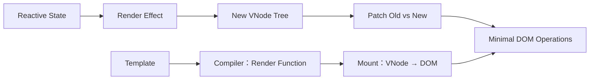

# Vue 3 渲染机制、组件更新与性能优化

> 适用环境：Vue 3.5+、TypeScript、Vite。本节先解释渲染系统如何工作，再讨论有证据的优化；内部编译产物用于理解，不应作为业务代码依赖的稳定公共 API。

## 1. 学习目标

完成本节后，你应该能够：

- 描述模板从编译到 DOM 更新的完整流水线。
- 区分响应式依赖触发、组件重新渲染和真实 DOM 修改。
- 理解静态提升、Patch Flags 与 Block Tree 的优化目的。
- 判断父组件更新时哪些子组件需要更新。
- 通过稳定 Props 限制组件更新范围。
- 正确使用 key，避免列表状态错位和意外重建。
- 理解 Vue 的批量调度与 `nextTick()`。
- 选择 `v-if`、`v-show`、`v-once`、`v-memo` 的合理场景。
- 处理大列表、深层响应式与不可变数据。
- 使用异步组件、代码分割和 KeepAlive 控制加载与实例生命周期。
- 用 DevTools、Performance Timeline 和用户指标定位瓶颈。
- 区分首屏性能、更新性能与感知性能。

## 2. 优化前先区分两类性能

### 页面加载性能

用户首次打开页面时，多久能看到主要内容、多久能可靠交互。影响因素包括：

- HTML 是否已有内容。
- JavaScript、CSS、字体与图片体积。
- 网络请求瀑布和服务端响应。
- JavaScript 解析、编译和执行。
- Hydration 或客户端挂载成本。

### 更新性能

页面已经运行后，用户输入、筛选、切换和拖动是否及时响应。影响因素包括：

- 响应式依赖数量。
- 组件更新范围。
- 渲染函数与 diff 成本。
- DOM 数量和布局/绘制成本。
- 长任务和同步计算。

把一个 computed 优化 0.2ms，不会修复 500KB 图片导致的 LCP；路由懒加载也不会自动修复输入时渲染 10,000 行造成的卡顿。

## 3. Vue 渲染流水线

高层流程：



### Compile

模板被编译为返回 VNode 树的 render function。Vite 构建时通常提前完成，不需要浏览器携带完整模板编译器。

### Mount

Renderer 调用 render function，创建 VNode，再创建真实 DOM。render 在响应式 effect 中运行，因此会收集本次读取的依赖。

### Patch

依赖变化后，更新任务进入调度队列。render function 再次运行生成新 VNode 树，Renderer 比较新旧树并对 DOM 做必要修改。

“组件更新”不等于“整个组件 DOM 全部重建”。很多更新只修改一个文本节点或 class。

## 4. VNode 是 UI 描述

概念化 VNode：

```ts
const vnode = {
  type: 'button',
  props: { class: 'primary' },
  children: '保存'
}
```

VNode 是普通 JavaScript 对象，描述期望的元素、组件、Props 与子节点。Virtual DOM 是一种声明式渲染模式，不是浏览器 DOM 的完整复制，也不是某个统一算法名称。

Vue 可以创建：

- 元素 VNode。
- 组件 VNode。
- Text、Comment、Fragment。
- Teleport、Suspense 等内置类型。

业务代码通常不需要直接操作 VNode；模板更易读、易做无障碍审查，也给编译器更多静态优化空间。

## 5. 响应式变化、Render 与 DOM 修改不是一回事

假设组件 render 读取 `title`，但没有读取 `unrelated`：

```ts
const title = ref('Vue')
const unrelated = ref(0)
```

修改 `unrelated` 不会因为它们属于同一 setup 就必然触发这个组件渲染。依赖收集基于 effect 执行期间实际读取。

即使 render effect 重跑：

- 新旧 VNode 可能相同。
- computed 结果可能保持稳定。
- Patch Flags 可让 runtime 只检查动态位置。
- DOM 属性值没变化时不会重复写入。

不要把“某个 reactive 变了”直接推导成“整页 DOM 重绘”。

## 6. 模板为什么通常比手写 Render Function 更好

模板语法范围可预测，编译器可以提前知道：

- 哪些节点永远静态。
- 哪个元素只可能改变 class。
- 哪个节点只有文本变化。
- Fragment 子节点顺序是否稳定。
- 哪些动态后代需要在更新时访问。

手写 render function/JSX 灵活，但动态 JavaScript 让静态分析更困难。使用它们应基于组件抽象需求，而不是“更接近底层所以更快”的猜测。

## 7. 静态提升与缓存

模板：

```vue
<section>
  <h1>课程目录</h1>
  <p>选择课程查看详情</p>
  <p>{{ selectedTitle }}</p>
</section>
```

前两个静态节点不依赖运行时状态。编译器可以在首次 render 外创建/缓存静态 VNode，后续更新直接复用并跳过比较。

连续的大块静态内容还可能合并为静态 VNode，通过 HTML 字符串高效挂载。

因此，把每一段静态模板手工拆成子组件不一定更快，反而可能增加组件实例和 Props/Slots 开销。

## 8. Patch Flags

编译器会给动态 VNode 写入更新提示。例如：

```vue
<div :class="{ active }">{{ title }}</div>
```

编译产物会标记它可能更新 class 和文本。Runtime 不必每次枚举所有属性或完整比较所有子节点。

Patch Flag 是位掩码，可组合多个动态类型，例如：

- TEXT。
- CLASS。
- STYLE。
- PROPS / FULL_PROPS。
- 稳定或有 key 的 Fragment。

这些名称和数值属于 Vue 内部实现理解材料。不要在业务逻辑中读取或写死它们。

## 9. Block Tree 与 Tree Flattening

一棵深 VNode 树可能只有少数动态后代。编译器用 Block 记录其中带 Patch Flags 的节点，更新时遍历扁平动态数组，而不必递归进入全部静态层级。

`v-if`、`v-for` 会改变结构，因此形成新的 Block 边界；父 Block 跟踪子 Block，保持正确性。

这解释了为什么 Vue 3 的 Virtual DOM 不是“每次无差别 diff 整棵树”：Compiler 与 Runtime 共同工作，Runtime 获得了模板静态信息。

## 10. SSR Hydration 也利用编译信息

服务端已经输出 DOM，客户端 Hydration 的目标是把事件与组件状态连接到现有 DOM，而不是重新创建所有节点。

Patch Flags 与 Block Tree 能帮助 Hydration 走更短路径。但前提是服务端与客户端首次渲染一致。

常见不一致来源：

- render 中直接使用 `Date.now()`、`Math.random()`。
- 服务端与客户端时区不同。
- 首次 render 读取 `window.innerWidth`。
- 无种子的随机 ID。
- 服务端和客户端权限/数据初值不一致。
- 非法 HTML 被浏览器自动修正。

Hydration mismatch 不只是控制台噪声，它可能导致丢弃 DOM、事件错误和额外渲染成本。

## 11. Vue 的更新是批量调度的

连续修改：

```ts
count.value++
count.value++
count.value++
```

Vue 不会同步更新 DOM 三次。组件更新任务被缓冲并去重，在下一次 flush 中使用最终状态执行，避免同一同步调用栈中的重复工作。

JavaScript 状态立即改变，DOM 通常尚未改变：

```ts
count.value++
console.log(count.value) // 新值
console.log(el.textContent) // 可能仍是旧 DOM
```

只有确实需要读取更新后 DOM 时才 `await nextTick()`。

## 12. `nextTick()` 不是什么

`nextTick()` 等待 Vue 下一次 DOM 更新 flush。它不是：

- 通用延时函数。
- 等待浏览器完成图片加载。
- 等待 CSS Transition 结束。
- 等待所有网络请求。
- 强制浏览器完成绘制。

若需要测量最终布局，有时还需等待 `requestAnimationFrame()`；若依赖字体或图片，还要等待对应资源。

完整批量更新示例：

<<< ../../../examples/frontend/vue3-rendering/RenderBatchingDemo.vue

## 13. Watcher Flush 时机

默认 watcher 回调通常发生在父组件更新后、所属组件 DOM 更新前。若回调要读取自身更新后的 DOM，可使用：

```ts
watch(source, callback, { flush: 'post' })
```

`watchPostEffect()` 是相应别名。`flush: 'sync'` 会同步触发，不参与普通批量处理，应谨慎用于简单布尔状态；对频繁数组操作使用可能造成大量回调。

不要用 post watcher 替代 computed。它仍用于副作用，只是调整副作用相对 DOM 更新的时机。

## 14. 什么会让子组件更新

Vue 官方的核心规则是：子组件至少有一个接收的 Prop 发生变化时才需要更新。还可能因为：

- 子组件自己的响应式依赖变化。
- 注入值或 Store 依赖变化。
- 父级提供的 Slot 内容需要更新。
- 强制 key 改变导致卸载重建。

父组件 render 执行不等于所有后代无条件完成 DOM patch。组件边界本身也是更新边界。

## 15. Props 稳定性

不稳定设计：

```vue
<LessonRow
  v-for="lesson in lessons"
  :lesson="lesson"
  :active-id="selectedId"
/>
```

`selectedId` 每变一次，所有行都收到新 Prop，所有行都要更新并自行判断是否选中。

稳定设计：

```vue
<LessonRow
  v-for="lesson in lessons"
  :lesson="lesson"
  :active="lesson.id === selectedId"
/>
```

大多数行的 `active` 从 false 到 false，没有变化；通常只有旧选中行和新选中行需要更新。

完整行组件：

<<< ../../../examples/frontend/vue3-rendering/LessonRow.vue

## 16. 对象与函数 Props 的身份

每次 render 创建新对象：

```vue
<Chart :options="{ color: theme.color }" />
```

即使内容一样，引用身份也不同，子组件会看到 Prop 变化。可以把稳定配置放入 computed：

```ts
const chartOptions = computed(() => ({ color: theme.value.color }))
```

但 computed 在依赖变化时仍会创建新对象，这是合理的。不要为了维持引用而写复杂缓存，除非 profiling 证明子组件更新昂贵。

Vue 模板中的方法监听器通常有编译优化，不能简单类比 React 的“每次必须 useCallback”。先测量实际组件更新。

## 17. Computed 稳定性

Vue 3.4+ 中，computed 新值与旧值相等时，不会继续触发依赖它的 effect：

```ts
const isEven = computed(() => count.value % 2 === 0)
```

从 0 变 2 时结果都为 true，依赖 `isEven` 的更新可跳过。

但每次返回新对象会失去这种稳定性：

```ts
const result = computed(() => ({ isEven: count.value % 2 === 0 }))
```

不要为了合并字段随意返回新对象。可返回 primitive、复用不可变结果，或让消费者读取更精确的 computed。

高级 computed 旧值复用必须先完成全部依赖读取，再比较返回，否则依赖集合可能不完整。一般业务不需要手写这种优化。

## 18. `key` 表示身份

`key` 告诉 Renderer 新旧子节点之间的身份对应关系。它不是仅为消除 warning，也不是数组索引的装饰。

```vue
<LessonRow
  v-for="lesson in lessons"
  :key="lesson.id"
/>
```

稳定 key 让 Vue 在插入、删除、移动时：

- 复用正确组件实例。
- 保留正确输入状态和焦点。
- 减少不必要 DOM 创建。
- 正确执行 TransitionGroup。

key 应为稳定 primitive，通常是数据库 ID 或客户端永久 ID。

## 19. 为什么索引通常不是好 key

列表 `[A, B, C]` 使用 0、1、2。删除 A 后，新列表 `[B, C]` 的 key 仍是 0、1：

- 原 A 实例可能被当作 B 复用。
- 原 B 实例可能被当作 C 复用。
- 输入本地状态、未受控 DOM 值和动画可能错位。

只有列表永远不重排、不插入、不删除，且行完全无状态时，索引 key 才可能无害；这种约束往往会随需求变化。

## 20. 改 key 会强制重建

```vue
<Editor :key="documentId" />
```

documentId 改变时，旧 Editor 被卸载，新实例挂载。这可用于明确“不同文档必须拥有不同本地状态”。

但以下写法会在每次 render 重建：

```vue
<Editor :key="Math.random()" />
```

它会丢失焦点、草稿、缓存，重复执行请求和生命周期，是性能与正确性问题。

不要用改 key 修复响应式 bug；先找到状态所有权和依赖问题。

## 21. 列表数据不要在模板里做昂贵工作

不推荐：

```vue
<LessonRow
  v-for="lesson in lessons.filter(expensivePredicate).sort(expensiveCompare)"
/>
```

模板每次执行都会重新过滤、排序并创建数组。使用 computed：

```ts
const visibleLessons = computed(() =>
  [...lessons.value]
    .filter(matchesQuery)
    .sort(compareLessons)
)
```

注意 `sort()`、`reverse()` 会原地修改数组；派生排序应先复制，避免 computed 修改源状态。

## 22. 一千条数据不一定等于一千个 DOM 都合理

内存中的 10,000 个简单对象可能没问题，但同时渲染 10,000 行 DOM 会带来：

- VNode 创建与 patch。
- DOM 节点内存。
- Style/Layout/Paint。
- 事件和可访问树成本。
- 键盘导航负担。

首选产品级减少可见数量：分页、搜索、分组、折叠。必须连续滚动大量行时再使用虚拟列表，只渲染视口附近节点。

虚拟化需要测试动态高度、滚动定位、键盘焦点、读屏顺序、打印和浏览器查找。

## 23. 深层响应式的成本

普通 `ref(largeObject)` 会把嵌套对象按访问需要转成响应式 Proxy。对巨大且近似不可变的数据，每次渲染深度访问可能产生明显代理开销。

`shallowRef()` 只追踪 `.value` 替换，内部对象保持原样：

```ts
const lessons = shallowRef(initialLessons)
```

更新必须采用不可变替换：

```ts
lessons.value = lessons.value.map(/* ... */)
```

以下不会触发 shallowRef：

```ts
lessons.value[0]!.title = '新标题'
```

Shallow API 是明确的根级更新契约，不是随处使用的“更快 ref”。

## 24. 完整列表性能示例

数据与不可变更新函数由现有 TypeScript 配置真实检查：

<<< ../../../examples/frontend/vue3-rendering/lesson-data.ts

页面使用 `shallowRef`、computed、稳定 key 和稳定 active Prop：

<<< ../../../examples/frontend/vue3-rendering/LessonCatalogPerformance.vue

这个示例仍一次渲染筛选后的全部行。若真实设备上 1,000 个复杂行已经卡顿，应先通过 profiling 判断成本来自 JavaScript、组件更新、Layout 还是 Paint，再决定分页或虚拟化。

## 25. `v-if` 与 `v-show`

### `v-if`

条件为 false 时子树不创建；切换时挂载/卸载组件、事件与 effect。初次 false 成本低，频繁切换成本较高。

### `v-show`

元素始终渲染，只切换 `display`。初始成本始终存在，频繁显示隐藏通常更便宜；组件 effect 在隐藏时仍可能运行。

选择依据是创建成本和切换频率，不是固定规则。大型低频面板适合 `v-if`；高频小提示可能适合 `v-show`。

隐藏敏感 UI 不是权限控制，数据和 API 仍需后端保护。

## 26. `v-once`

`v-once` 首次渲染后跳过整个子树更新：

```vue
<p v-once>创建时间：{{ createdAt }}</p>
```

适合值在组件生命周期内保证不变的运行时内容。若业务后来允许修改，界面会永久显示旧值且难排查。

纯静态模板本就会被编译器优化，不需要手工添加 `v-once`。

## 27. `v-memo`

`v-memo` 根据依赖数组是否变化跳过子树更新：

```vue
<LessonRow
  v-for="lesson in lessons"
  :key="lesson.id"
  v-memo="[lesson.title, lesson.status, lesson.id === selectedId]"
/>
```

它面向非常大的子树/列表且已确认更新成本明显的场景。依赖漏写会让 UI 不更新，等价于手工维护缓存失效规则。

先稳定 Props、减少可见节点和修复昂贵计算，再考虑 `v-memo`。对普通组件，Vue 自身优化通常足够。

## 28. 组件抽象也有成本

每个组件实例需要：

- setup 和 effect。
- Props/Slots 处理。
- 生命周期与作用域。
- VNode 和调度。

不要为每个 `<span>` 创建一层只转发 Props 的组件，尤其在数千行列表中。组件边界应服务于复用、状态所有权、懒加载或稳定更新边界。

也不要反过来把整个页面写成一个组件。大组件会扩大 render effect、降低可读性，并使局部异步加载和测试困难。

## 29. Slots 对更新边界的影响

Slot 内容在父组件作用域编译，依赖父级状态。把动态内容传进子组件 Slot，不代表它自动成为完全独立更新单元。

Scoped Slot 是函数调用，过度嵌套的无渲染组件会增加运行时层级。Vue 3 已对 Slots 有很多优化，但高频大列表仍应避免无价值包装。

性能优化不能牺牲 API 清晰性；只有 profiling 证明 Slot 抽象是热点时才调整结构。

## 30. 异步组件与代码分割

`defineAsyncComponent()` 接收返回 Promise 的 loader：

```ts
const AnalyticsPanel = defineAsyncComponent(
  () => import('./AnalyticsPanel.vue')
)
```

Bundler 识别动态 import 并生成独立 chunk。组件只有实际渲染时才加载。

高级选项包括：

- `loadingComponent` 与显示延迟。
- `errorComponent`。
- `timeout`。
- `onError` 重试/失败策略。
- 与 Suspense 的交互。

## 31. 完整异步组件示例

宿主与失败重试：

<<< ../../../examples/frontend/vue3-rendering/AsyncPanelHost.vue

加载状态：

<<< ../../../examples/frontend/vue3-rendering/LoadingPanel.vue

错误状态：

<<< ../../../examples/frontend/vue3-rendering/ErrorPanel.vue

被延迟加载的组件：

<<< ../../../examples/frontend/vue3-rendering/AnalyticsPanel.vue

短请求延迟展示 Loading 可避免一闪而过；超时不代表底层网络一定停止，需要结合资源加载和产品重试策略。

## 32. 路由懒加载与异步组件不要混淆

Vue Router 路由记录直接接受动态导入函数：

```ts
component: () => import('./LessonView.vue')
```

不需要再包 `defineAsyncComponent()`。Router 会在导航解析阶段管理路由组件加载。

`defineAsyncComponent()` 适合页面内部按条件显示的组件，如分析面板、富文本编辑器和图表。

## 33. 拆包不是越多越好

每个 chunk 都有：

- 请求与优先级管理成本。
- 模块解析/执行成本。
- 缓存和部署版本关系。
- 可能的加载瀑布。

过度拆分会让进入页面时串行加载多层组件。合理粒度通常是路由、低频大型功能或可独立缓存的功能组。

用真实生产构建的 bundle report 与网络瀑布评估。开发服务器的模块请求结构不能代表生产 chunk。

## 34. 预加载与预取

懒加载推迟成本，但用户点击后才开始下载可能产生等待。可以在高置信度信号下预热：

- 链接 hover/focus。
- 浏览器空闲。
- 当前步骤完成后预取下一步。
- 视口接近入口。

预加载会消耗流量和 CPU，不应把所有懒加载 chunk 在首屏立即取回。考虑 Save-Data、弱网与移动设备。

## 35. `<KeepAlive>` 缓存的是组件实例

动态组件切换默认卸载旧实例，本地状态丢失。KeepAlive 把实例放入停用状态：

```vue
<KeepAlive :max="5">
  <component :is="activeComponent" />
</KeepAlive>
```

再次显示时激活原实例，而不是重新 setup。它缓存：

- 本地响应式状态。
- 组件实例和子树。
- 某些已创建资源引用。

它不是通用 API 数据缓存，也不等于隐藏 DOM。

## 36. KeepAlive 生命周期

缓存组件离开 DOM 时不会执行普通卸载流程，而是 `onDeactivated()`；重新插入时执行 `onActivated()`。

适合在停用时暂停：

- 轮询和计时器。
- WebSocket 消费。
- ResizeObserver。
- 视频/动画。

这些 effect 不会因为组件看不见就自动停止。普通后代也可能收到 Activated/Deactivated 生命周期。

## 37. 完整 KeepAlive 示例

工作区：

<<< ../../../examples/frontend/vue3-rendering/CachedWorkspace.vue

有本地草稿与缓存生命周期的编辑器：

<<< ../../../examples/frontend/vue3-rendering/EditorPanel.vue

有独立本地状态的预览：

<<< ../../../examples/frontend/vue3-rendering/PreviewPanel.vue

`:max="2"` 形成有限 LRU 缓存。真实路由缓存还要定义 include/exclude、按哪个 key 区分实体，以及何时因为权限或数据版本变化主动失效。

## 38. KeepAlive 常见误区

### 缓存所有路由

内存持续增长，旧权限、旧数据和未停止副作用长期存在。

### 用 KeepAlive 代替 Store

状态只能在缓存实例存在期间访问，跨页面业务事实仍应有明确 Store/服务端所有者。

### 忘记组件 name

include/exclude 按组件 name 匹配。`<script setup>` 的 SFC 名通常可由文件名推断，但重构文件名会改变匹配结果。

### 把 Deactivated 当 Unmounted

实例仍存在，资源清理策略不同。最终卸载时 deactivated 也可能触发，清理应可重复且幂等。

## 39. Transition 与性能

优先动画 `transform` 和 `opacity`，它们通常避免每帧触发布局。动画 width、height、top、left 可能不断 Layout/Paint。

大量节点同时 TransitionGroup 移动会昂贵。尊重 `prefers-reduced-motion`，并避免动画延迟关键交互。

Vue Transition 负责进入/离开类和生命周期，不会自动让任意 CSS 属性变得高性能。

## 40. 测量工具

### Vue DevTools

查看组件树、更新与性能分析，定位哪些组件更新次数异常。

### Chrome Performance

查看 Main Thread、Long Task、Script、Style、Layout、Paint 与交互。启用开发配置中的 `app.config.performance` 可在支持的浏览器时间线上增加 Vue 标记。

### Network 与 Coverage

检查请求瀑布、chunk、缓存和未使用 JavaScript。

### User Timing API

对关键业务流程使用 `performance.mark()` / `performance.measure()`，而不是在生产中到处 `console.time()`。

开发模式包含额外检查和 HMR，最终结论应在接近生产的构建与设备上验证。

## 41. Web Vitals 与 Vue

- LCP：主要内容出现速度，受 HTML、资源和渲染架构影响。
- INP：交互后的整体响应延迟，受长任务、更新范围和布局影响。
- CLS：意外布局位移，常由无尺寸图片、异步内容和字体造成。

框架组件更新时间只是其中一部分。INP 慢可能是事件回调、第三方脚本、Layout 或 Paint，而不是 VDOM diff。

实验室数据帮助重现，真实用户监控反映设备与网络分布。优化应同时观察分位数，而不只看开发者高配电脑均值。

## 42. 如何分析一次慢交互

1. 记录用户操作和可感知慢点。
2. 在生产模式、目标设备与现实数据量复现。
3. Performance 录制，定位长任务区间。
4. 区分 Script、Style/Layout、Paint 或网络等待。
5. 用 Vue DevTools 找出异常更新组件。
6. 检查 Props 身份、列表数量和昂贵 computed/watcher。
7. 做一个最小改动。
8. 用相同场景重新测量并记录结果。

没有 before/after 数据的“优化”只是代码改写。

## 43. OnRenderTracked 与 OnRenderTriggered

Vue 提供开发期调试 Hook：

```ts
onRenderTracked((event) => {
  debugger
})

onRenderTriggered((event) => {
  debugger
})
```

前者显示 render 收集了什么依赖，后者显示哪个依赖触发更新。它们适合定位意外依赖，不应作为生产统计方案。

调试输出可能非常多；缩小到具体组件并设置断点，比全局打印更有效。

## 44. 不要在 Render 中制造副作用

模板表达式和 computed 应保持纯：

```vue
<!-- 错误方向：渲染时修改状态 -->
<p>{{ items.sort(compare).length }}</p>
```

Render 可能因任意依赖更新而重复执行。副作用会造成：

- 无限更新。
- 源数组被意外重排。
- SSR 不一致。
- 性能难预测。

事件、watcher、生命周期或 action 才是副作用边界。

## 45. DOM 读取与布局抖动

循环中交替写样式和读布局：

```ts
for (const element of elements) {
  element.style.width = '200px'
  console.log(element.offsetWidth)
}
```

可能迫使浏览器重复同步 Layout。即使 Vue patch 很快，布局抖动仍会卡。

把 DOM 读取批量放在写入前，或让浏览器在帧边界处理。ResizeObserver 比持续轮询尺寸更合适，但回调也要避免反馈循环。

## 46. 响应式大对象与外部系统

第三方类实例、图表对象和不可代理对象可用 `markRaw()`；外部状态树可放入 `shallowRef()`，在外部状态变化时替换根引用。

这些 Advanced API 会在响应式树中制造不同语义：

- 深层变更可能不触发更新。
- raw 与 proxy 身份比较可能困惑。
- 团队成员必须知道更新契约。

只在集成边界或已测量的大数据场景使用，不要把所有对象 markRaw 作为默认优化。

## 47. 页面加载优化的优先级

常见高收益顺序：

1. 选择正确渲染架构：CSR、SSR、SSG 或渐进增强。
2. 优化图片、字体和关键 CSS。
3. 减少首屏 JavaScript 与第三方脚本。
4. 路由/功能级代码分割。
5. 避免串行数据和 chunk 瀑布。
6. 配置压缩、缓存和 CDN。
7. 再处理微小 Runtime 优化。

内容站若只需要少量交互，不一定应发送完整 SPA。Vue 官方也建议按页面性质选择架构，而不是所有项目统一 CSR。

## 48. Bundle Size 与 Tree Shaking

现代 ESM 构建可以移除未使用导出，但前提是：

- 依赖提供可 tree-shake 的 ESM。
- 模块没有阻止分析的副作用。
- 不是从巨型 CommonJS 包导入。
- 实际使用方式允许删除未引用代码。

不要只看 npm 包压缩大小；检查它在当前构建和导入方式下的真实增量。

Vue SFC 构建时已预编译模板，无需浏览器携带 Runtime Compiler。不要随意改用包含编译器的完整构建。

## 49. 缓存与发布一致性

代码分割后，HTML/入口可能引用带 hash 的 chunk。安全缓存策略通常是：

- 带内容 hash 的静态资源长期不可变缓存。
- HTML 短缓存或协商更新。
- 发布保留一段时间的旧 chunk，避免打开中的旧页面加载失败。
- Service Worker 有明确更新协议。

捕获 `ChunkLoadError` 后盲目无限刷新会形成循环。可提示有新版本，记录当前版本，并最多执行受控恢复。

## 50. 常见伪优化

### 所有值都 computed

computed 有缓存和依赖管理成本。只读取一次的廉价表达式不一定需要缓存。

### 所有组件都异步

制造请求瀑布和 Loading 闪烁，首屏反而更慢。

### 所有对象都 shallowRef

团队继续原地修改后 UI 不更新，正确性成本大于收益。

### 给所有列表加 `v-memo`

维护缓存依赖，漏写后出现陈旧 UI。先稳定 Props 和减少 DOM。

### 把大组件机械拆成很多微组件

实例和 Slot 层级增多，未必减少实际更新。

### 用 `setTimeout` 等 DOM 更新

时序不可靠。等待 Vue DOM flush 使用 `nextTick()`，等待绘制使用帧 API。

### 每次都用动态 key 强制刷新

卸载重建掩盖状态问题，破坏焦点和缓存。

## 51. Vue 2 迁移提示

- Vue 3 编译器与 Runtime 协作更深入，使用 Block Tree 与 Patch Flags。
- 多根组件由 Fragment 支持，不必为了性能增加无意义 wrapper。
- Vue 3 响应式基于 Proxy，不再有 Vue 2 新增属性/数组索引检测限制。
- 仍要避免无意义深度 watcher 和大列表 DOM。
- `v-once` 继续存在，Vue 3 增加 `v-memo`。
- KeepAlive 生命周期在 Composition API 中对应 `onActivated` / `onDeactivated`。
- 异步组件使用 `defineAsyncComponent()`；路由组件继续由 Router 动态导入。
- 不要机械迁移 Vue 2 的 `$forceUpdate()` 或改 key workaround，先检查新响应式边界。

## 52. 工程检查清单

- 问题属于加载性能还是更新性能？
- 是否在生产模式和目标设备上测量？
- 是否有用户指标和明确 before/after？
- 模板/Render 是否保持无副作用？
- 子组件 Props 是否尽量稳定？
- 是否在 render 中创建昂贵对象或执行排序？
- 列表是否使用稳定业务 key？
- 当前 DOM 数量是否真的合理？
- 大型不可变结构是否值得 shallowRef？
- `v-if` / `v-show` 是否按切换频率选择？
- `v-once` / `v-memo` 是否有严格不变条件和测量依据？
- 异步组件是否有 Loading、Error、超时和恢复策略？
- 是否避免路由懒加载与 defineAsyncComponent 重复包装？
- KeepAlive 是否有限额、失效和副作用暂停策略？
- DOM 测量是否在正确 flush/frame 时机？
- SSR 首次输出是否确定且可 Hydrate？
- Bundle 优化是否基于真实构建产物？

## 53. 概念辨析与因果回顾

### Vue 3 从模板到 DOM 经历什么？

模板先编译为 render function；挂载时 render effect 收集响应式依赖并创建 VNode/DOM；依赖变化后重新 render，Runtime patch 新旧 VNode 并更新必要 DOM。

### Patch Flags 解决什么问题？

编译器告诉 Runtime 节点可能变化的类型，使更新只检查文本、class 或指定 Props 等动态部分，而不做通用全量比较。

### 为什么父组件更新不一定让所有子组件更新？

组件是更新边界。子组件主要在自身依赖或接收 Props 变化时更新；稳定 Props 可让无关行跳过更新。

### `nextTick()` 的作用是什么？

等待 Vue 已缓冲的 DOM 更新完成。它不保证网络、资源加载、CSS 动画或浏览器绘制完成。

### key 的本质是什么？

key 表示新旧子节点的稳定身份对应，用于正确复用、移动、卸载组件和 DOM。

### shallowRef 为什么可能更快又更危险？

它不代理深层结构，减少深层响应式开销；但内部原地修改不会触发更新，必须遵守根引用不可变替换契约。

### KeepAlive 和 v-show 有什么区别？

KeepAlive 缓存被动态移出的组件实例并触发 activated/deactivated；v-show 保持 DOM 在原位置，仅切换 display。

### 如何证明一次优化有效？

在一致数据、设备和生产构建下记录 before/after，定位瓶颈类型，并观察用户指标或明确的交互时长变化。

## 54. 本节总结

- Vue 的渲染由 Compiler、响应式 Render Effect 和 Runtime Renderer 协作完成。
- 静态提升、Patch Flags 和 Block Tree 让 Virtual DOM 更新具有编译信息。
- 响应式变化不等于整棵 DOM 重建，Vue 会批量调度并跳过稳定部分。
- `nextTick()` 只等待 Vue DOM flush。
- 稳定 Props 和 key 是可靠组件更新边界的基础。
- 大列表问题通常先通过减少 DOM、稳定身份和避免昂贵派生解决。
- shallowRef 适合大型不可变结构，但要求根级替换。
- 异步组件改善非首屏功能加载，拆包粒度必须结合网络瀑布测量。
- KeepAlive 缓存实例，需要限额、失效和停用副作用管理。
- 性能优化必须区分 Load 与 Update，并用生产环境数据验证。

## 55. 下一步学习

下一节建议学习：**Vue 3 测试策略与可测试架构**。

将继续讲解 Vitest、Vue Test Utils、组件行为测试、Composable、Pinia、Router、异步请求、Mock 边界、无障碍断言与端到端测试分层。

## 56. 参考资料

- [Vue 官方指南：Rendering Mechanism](https://vuejs.org/guide/extras/rendering-mechanism.html)
- [Vue 官方指南：Performance](https://vuejs.org/guide/best-practices/performance.html)
- [Vue 官方指南：List Rendering](https://vuejs.org/guide/essentials/list.html)
- [Vue 官方指南：Async Components](https://vuejs.org/guide/components/async.html)
- [Vue 官方指南：KeepAlive](https://vuejs.org/guide/built-ins/keep-alive.html)
- [Vue API：nextTick](https://vuejs.org/api/general.html#nexttick)
- [Vue API：shallowRef](https://vuejs.org/api/reactivity-advanced.html#shallowref)
- [Vue API：onRenderTracked / onRenderTriggered](https://vuejs.org/api/composition-api-lifecycle.html#onrendertracked)
- [Vue 官方指南：SSR Hydration Mismatch](https://vuejs.org/guide/scaling-up/ssr.html#hydration-mismatch)
- [web.dev：Web Vitals](https://web.dev/articles/vitals)
